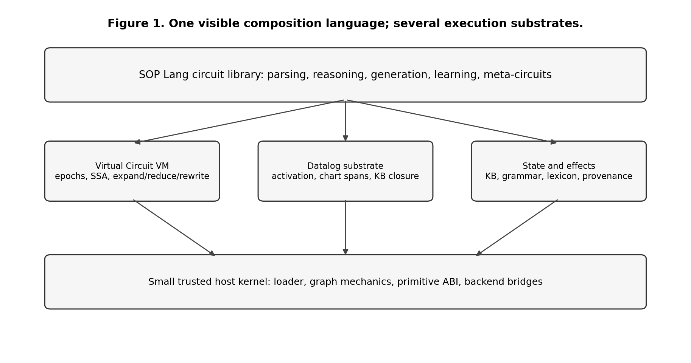
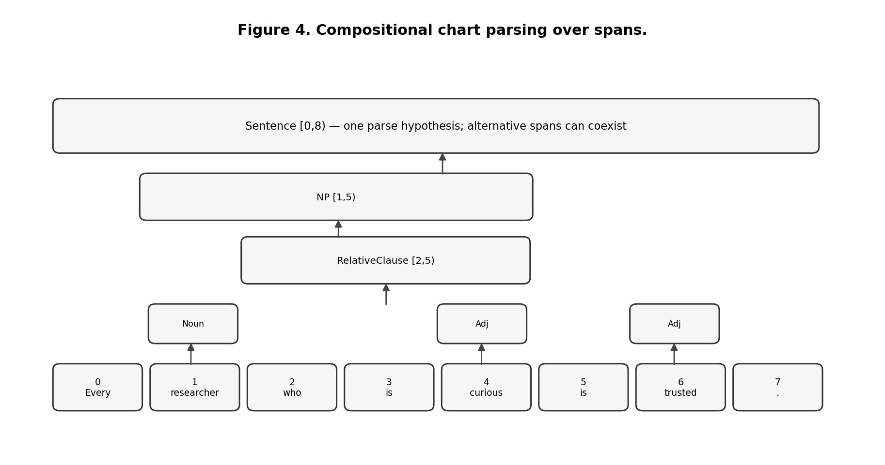
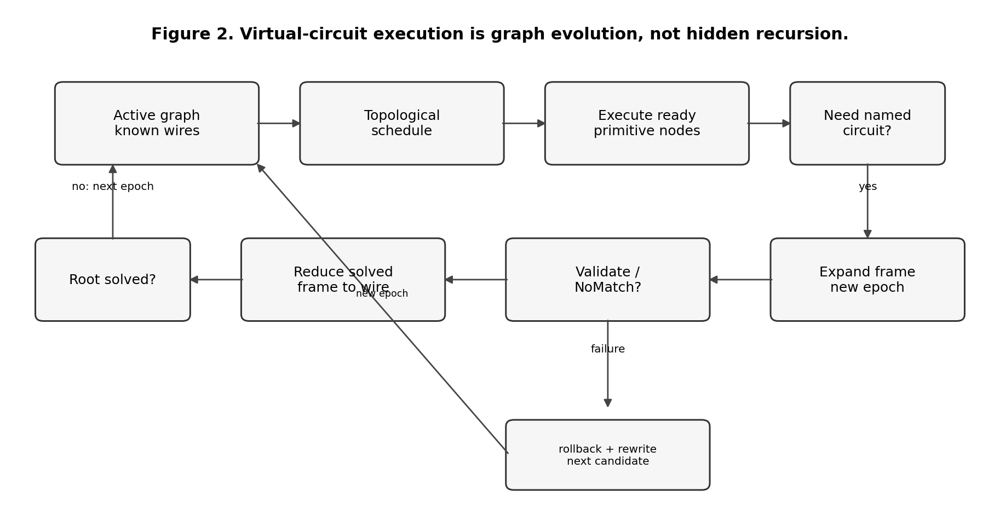
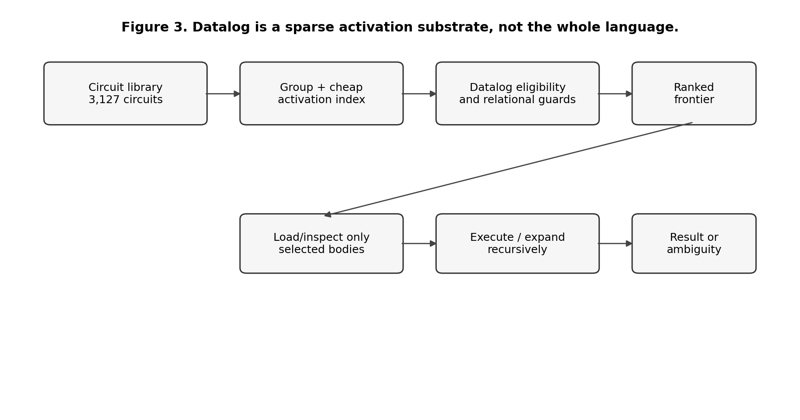
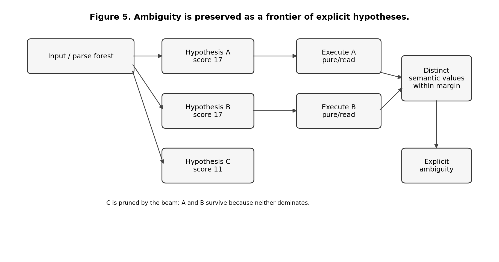
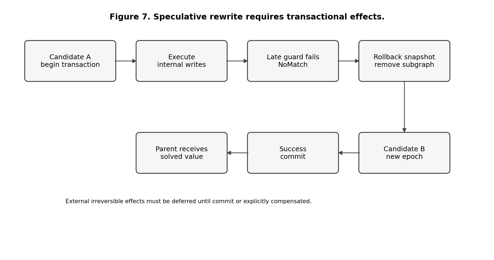
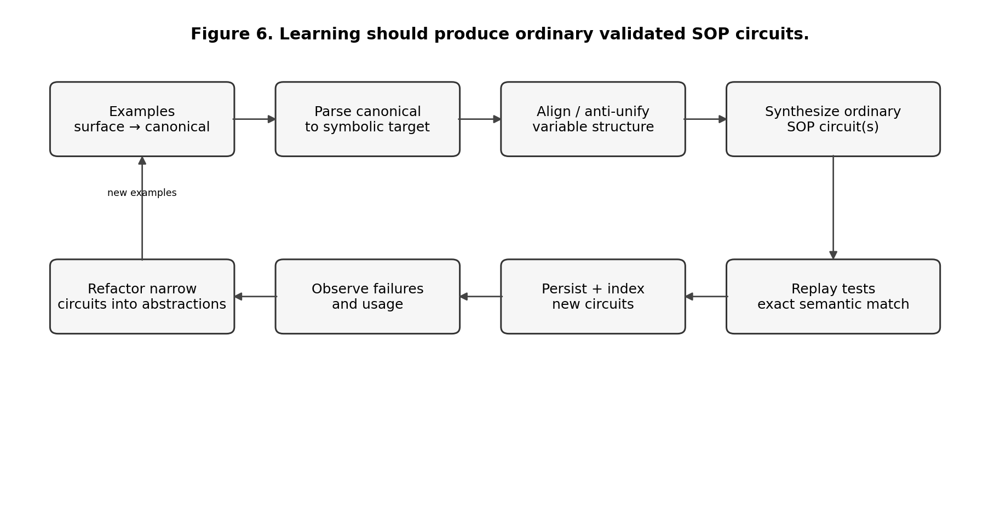
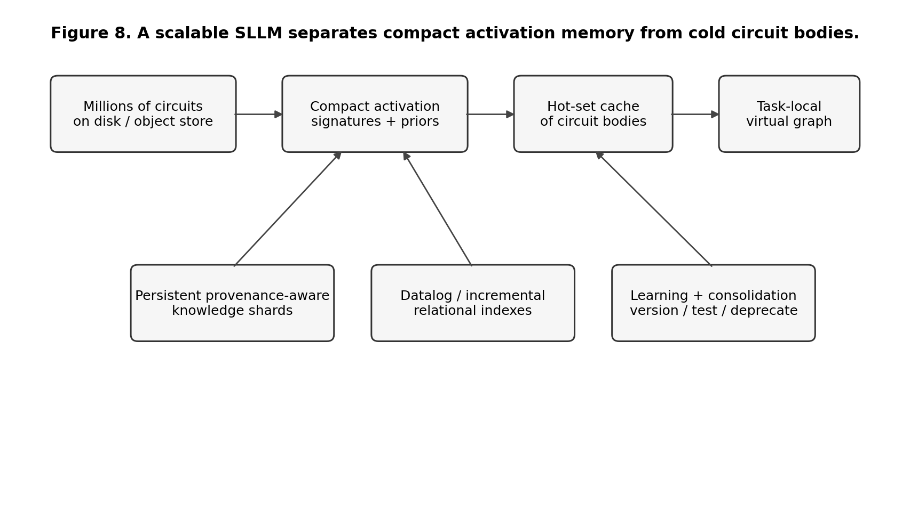

# Contents

Part I — The Problem and the Design Discipline  
1. What We Are Trying to Build  
2. The One-Language Rule  
3. Engineering Foundations  
4. A Precise Model of a SOP Circuit

Part II — Execution Architecture  
5. The Virtual Circuit Machine  
6. Datalog as a Relational Substrate  
7. Compositional CNL Parsing  
8. Ambiguity, Search, and Parallel Speculation  
9. Knowledge, Inference, and Provenance  
10. Transactions, Effects, and Safe Rewrite  
11. Symbolic Generation and Reflection  
12. Learning by Inducing Circuits

Part III — Current Implementation and Validation  
13. The Current Executable System  
14. Scale and Observable Behavior  
15. What the Tests Prove — and What They Do Not

Part IV — The Remaining Research Program  
16. Semantic Depth: What Better Circuit Libraries Must Represent  
17. Scaling Search and Long-Term Circuit Memory  
18. Learning at Scale  
19. Meta-Programming, Rewrite, and E-Graphs  
20. Alternative Backends and Why They Should Remain Replaceable  
21. A Falsifiable Experimental Roadmap  
22. Final Assessment

Part V — Detailed Engineering Specification  
23. A Complete End-to-End Execution Walkthrough  
24. Designing a Broad CNL Without Pretending It Is English  
25. System Invariants and Acceptance Checks  
26. Engineering a Production-Scale Runtime  
27. Research Hypotheses to Keep Separate

Appendix A — Core Algorithms in Pseudocode  
Appendix B — SOP Idioms  
Appendix C — Datalog Patterns Relevant to SOP-SLLM  
Appendix D — Benchmark and Measurement Matrix  
Appendix E — Glossary  
Appendix F — References and Further Reading  
Appendix G — Source Artifact and Reproducibility Notes

# Preface

This book describes the current SOP-SLLM architecture and executable reference implementation. The central question is whether useful language competence can be represented primarily as **executable semantic circuits** rather than being concentrated inside one opaque monolithic model. The working name **SLLM** means *Symbolic Language Model*. **SOP Lang** is the single visible authoring and composition language. Datalog is used as a relational reasoning and circuit-activation substrate. JavaScript provides the small trusted runtime needed to load circuits, manage graph execution, enforce effects and transactions, and bridge to specialized backends.

The purpose of the book is not to claim that the system is a general language model. It is not. The purpose is to specify the architecture precisely enough that a software engineer can implement it, test it, extend it, measure it, and falsify its central hypotheses. Every mechanism described as implemented is present in the accompanying repository. Proposed mechanisms are labeled as proposals. Open research questions are separated from tested behavior.

The current reference implementation contains 3,168 SOP circuit files across the base library and included extensions, including 2,918 generated micro-circuits and a reference document-to-circuit knowledge pack. It contains about 102,430 lines of SOP and about 2,155 lines of runtime JavaScript under `src/`. Thirty-six automated tests pass against the bundled Datalog backend. These numbers are engineering observations, not evidence of intelligence. Their value is that they make activation, ambiguity, library growth, and runtime boundaries observable at a scale larger than a toy parser.

The central architectural claim is deliberately narrow and falsifiable:

> A small generic runtime can operate a large and growing library of executable semantic circuits, select relevant circuits from state, compose them recursively into a task-local virtual circuit, reason over explicit symbolic knowledge, preserve ambiguity, rewrite failed interpretations safely, and improve by adding or inducing new circuits while the trusted runtime remains comparatively stable.

The design follows a strict **one-language rule**. Ordinary competence must be expressed as SOP circuits and typed data. Datalog, internal graph IR, indexes, and backend-specific structures may exist behind implementation boundaries, but ordinary circuit authors and learning agents should not need secondary ad-hoc DSLs. The repository contains regression tests that enforce this boundary.

The book distinguishes four categories. **Implemented mechanism** means executable code covered by tests. **Design** means a specified mechanism whose implementation may still be incomplete. **Hypothesis** means a claim to be tested experimentally. **Research direction** means a plausible extension that has not yet earned stronger status. This distinction prevents architectural names from being mistaken for demonstrated capability.

The intended reader needs ordinary undergraduate-level programming knowledge. The required graph, database, parsing, search, and transaction concepts are introduced from first principles. Mathematics is used only where it makes an algorithm or invariant more precise. Pseudocode and simple diagrams are preferred when notation would add no engineering value.

# Part I — The Problem and the Design Discipline

# 1. What We Are Trying to Build

## 1.1 From a language parser to a symbolic language model

A conventional symbolic natural-language system is often organized as a pipeline: tokenize text, parse syntax, construct semantics, run a reasoner, then generate an answer. That architecture is useful, but it tends to freeze the boundaries between components. The parser is implemented as a parser, the rule engine as a rule engine, and the generator as a generator. Extending the system often means extending several unrelated subsystems.

The SLLM experiment starts from a different abstraction. A **circuit** is a named executable graph that consumes values and produces values. A circuit may parse a phrase, infer a relation, decide which other circuit to try, query the knowledge base, produce a response plan, or inspect an earlier execution trace. These roles are not separate syntactic categories. They are ordinary circuits composed from other circuits and a small set of primitives.

This gives a different mental model. Instead of asking “which parser function handles this sentence?”, the runtime repeatedly asks “given the state I have now, which circuits are plausible next expansions?” The active computation is not known in advance. It is constructed incrementally.



The long-term ambition is not merely to create a controlled-language rule engine. It is to test whether language competence can be represented as an evolving body of reusable executable knowledge. In that view, vocabulary, grammar, semantic interpretation, reasoning patterns, response plans, domain strategies, validation rules, and meta-reasoning strategies may all be learned as circuits. The runtime is closer to a virtual machine than to a linguistic model.

## 1.2 What the word “model” means here

The phrase *language model* usually refers today to a statistical model that assigns probabilities to token sequences or generates language from learned parameters. SLLM uses the term differently. Its “model” is the combination of a circuit library, persistent knowledge circuits, materialized symbolic reasoning state, activation indexes, and explicit execution state. The system models language behavior by selecting and composing executable structures rather than by evaluating one dense parameter tensor.

This distinction does not imply that symbolic is inherently superior to neural. Neural models have enormous strengths in perception, fuzzy matching, broad coverage, and fluent generation. The experiment asks whether some capabilities that are difficult to inspect, update, constrain, or prove in neural systems can be made explicit in a circuit-based model. It also leaves open a hybrid architecture in which neural components propose circuits, rank hypotheses, acquire knowledge, or realize prose while symbolic circuits preserve execution, provenance, and validation boundaries.

## 1.3 Success criteria

The experiment needs stronger criteria than “the demo answers a few questions.” A useful architecture should show several properties together.

First, **kernel stability**: adding ordinary language phenomena should usually add SOP circuits or declarative knowledge rather than JavaScript branches. Second, **compositionality**: longer structures should reuse shorter structures rather than require one template for every length. Third, **sparse activation**: a library of thousands or millions of circuits should not require trying them all. Fourth, **explicit uncertainty**: ambiguous or unsupported interpretations should remain ambiguous or unknown rather than silently becoming a confident answer. Fifth, **safe rewrite**: speculative interpretations must not leak side effects. Sixth, **inspectable learning**: new competence should become ordinary circuits and tests, not an opaque side store. Seventh, **falsifiability**: benchmark failures must tell us whether the limitation lies in representation, search, learning, scaling, or the fundamental circuit hypothesis.

These criteria are stricter than producing good-looking natural language. They are meant to determine whether the architecture remains coherent as it grows.

# 2. The One-Language Rule

## 2.1 Why the circuit abstraction exists

SOP Lang exists to provide one reusable abstraction for computation that would otherwise be fragmented across parsers, rule engines, planners, generators, and meta-programs. A **circuit** is a named executable graph with explicit inputs, nodes, dependencies, and outputs. A parser is a circuit. An executor is a circuit. A response planner is a circuit. A circuit selector is a circuit. A reflection or learning procedure may also be represented as a circuit when its operations can be expressed through existing primitives.

A minimal example is:

```text
@input command

@executors selectCircuits
    group "executor"
    value $command

@answer callCandidates
    candidates $executors
    command $command

@output result $answer
```

The author-facing concepts are intentionally few: inputs, named nodes, references to earlier wires, circuit calls, primitive calls, and outputs. Groups, indexes, compiled Datalog projections, and runtime frames are implementation mechanisms rather than additional languages.

## 2.2 The authoring boundary

The architectural rule is:

> **Ordinary language, reasoning, generation, and learned competence are authored as SOP circuits plus typed data.**

The trusted kernel may implement primitives such as tokenization, graph operations, KB access, Datalog evaluation, transaction snapshots, and string concatenation. These primitives form a machine ABI. They are allowed because some bootstrap semantics must ultimately be implemented in a host language. What is not allowed is a growing host-language vocabulary that mirrors linguistic categories, grammar rules, response templates, or domain predicates.

This gives a practical audit criterion. Adding a new verb, clause form, reasoning pattern, or response strategy should normally add or modify SOP files and tests. If ordinary competence repeatedly requires new JavaScript branches, new delimiter conventions, or another author-facing syntax, the architecture is failing its own abstraction boundary.

## 2.3 Generic relational lowering for activation

Datalog helps select candidate circuits, but the selector must not know a privileged list of linguistic guard names. Instead, a primitive may declare a conservative **relational projection** next to its trusted implementation metadata. For example, a primitive that checks a token at a position may expose a projection stating that a candidate requires an observation of the form `(token-position, index, value)`. A primitive that has no safe cheap projection remains fully usable; it simply contributes no pre-expansion filter.

The selector operates generically:

```text
ordinary SOP circuit
        ↓
inspect primitive metadata
        ↓
collect conservative activation requirements
        ↓
activation index removes structurally impossible candidates
        ↓
Datalog validates and ranks the remaining candidate relations
        ↓
selected SOP circuits are expanded normally
```

The runtime guards remain the semantic authority. The activation projection is only an optimization and ranking aid. Therefore it may admit extra candidates, but it must not reject a candidate that could succeed.

A stronger compiler may later derive projections automatically from arbitrary pure relational SOP fragments using backward slicing, abstract interpretation, or partial evaluation. That is a research direction; the current implementation uses primitive-local declarative projections consumed through a generic interface.

## 2.4 Grammar symbols are typed data

Grammar productions need to distinguish literal terminals from grammar categories. This distinction is represented explicitly as typed values rather than by packing meaning into string prefixes.

Conceptually:

```text
Terminal("if")
Category("Atom")
Category("ConditionList")
```

SOP grammar-installation circuits construct these values through ordinary primitives. The chart parser consumes the typed structures. A learning procedure that synthesizes grammar rules produces the same values. No private grammar-string convention is required.

Typed data makes the representation safer and easier to inspect. It also leaves room for extensions such as lexical classes, feature structures, namespaces, weights, and provenance without inventing new delimiters.

## 2.5 Natural-language realization is circuit composition

Generation follows the same rule. There is no separate interpolation language for response templates. Atom realization is a circuit-selection problem. `RealizeAtom` selects an appropriate realizer circuit, which inspects structured fields such as predicate, arguments, polarity, qualifier, and lexical information. The circuit composes text using ordinary operations such as `concat`, `join`, and recursive realization of substructures.

A summary, comparison, explanation, or reflection response is likewise an ordinary SOP circuit. This makes generation knowledge subject to the same tracing, testing, selection, learning, effect analysis, and rewrite mechanisms as parsing and reasoning.

The current generator is deliberately symbolic and relatively constrained. Its architectural significance is not literary quality; it demonstrates that multi-sentence answers do not require a second semantic language inside the host runtime.

## 2.6 Semantic structure uses explicit fields

Structured meaning must not be encoded inside names when it can be represented directly. A modal atom, for example, is represented conceptually as:

```text
predicate = "help"
qualifier = "can"
arguments = [alice, bob]
polarity = positive
```

The same principle applies to tense, source, confidence, provenance, namespace, and other attributes as the semantic representation grows. Explicit fields are not automatically a complete theory of modality or time, but they keep the representation open to principled extension and prevent parsers from depending on private string conventions.

## 2.7 Primitive-local semantics and effect metadata

Each primitive has a trusted implementation and may expose metadata describing properties needed by generic runtime services. Examples include:

```text
effect = pure | read | transactional-write | external
activationProjection = optional conservative relational projection
resultKind = optional structural type information
```

The effect analyzer consumes effect metadata generically. The activation system consumes activation metadata generically. No subsystem should maintain a second list keyed by primitive names for the same semantic property.

This is a general design rule: **semantic properties belong with the object whose semantics they describe**. Central registries may index those properties, but they should not redefine them independently.

## 2.8 Internal representations are allowed

One visible language does not mean one internal representation. A compiler or runtime may transform SOP into an AST, an SSA graph, typed grammar values, Datalog relations, indexes, bytecode, SQL, or an e-graph. These are execution forms behind controlled boundaries.

They become architectural problems only when normal authors or learning agents must coordinate an additional ad-hoc syntax to express ordinary competence. The useful distinction is therefore not “SOP versus all other data structures.” It is **authoring semantics versus implementation representation**.

The trusted kernel is allowed to contain a small explicit set of VM structural operations such as circuit call, candidate call, expansion, reduction, transaction handling, and backend invocation. These operations should remain small, documented, and regression-tested. They should not grow in proportion to English vocabulary, grammar coverage, or domain knowledge.

# 3. Engineering Foundations

This chapter defines the basic theories used by the current implementation. The goal is not to teach a full course in compilers, databases, or formal languages. It is to establish exactly what each concept contributes to the SLLM design.

## 3.1 Directed graphs and dependency graphs

A directed graph contains vertices and directed edges. In a circuit, a vertex is usually an operation and an edge means that one operation needs a value produced by another. If node `B` consumes `$a`, produced by node `A`, there is a dependency edge from `A` to `B`.

A graph is a **DAG**, a directed acyclic graph, if no path returns to its starting node. A DAG has at least one topological ordering: an ordering of nodes in which every dependency appears before the node that consumes it. Standard topological sorting takes time proportional to the number of vertices plus edges.

SOP circuits use this idea because textual order should not be the execution semantics. Independent nodes may execute in either order or in parallel. The data dependencies determine readiness.

## 3.2 Static single assignment

**SSA**, static single assignment, is a representation in which each named variable or wire is assigned once. In SOP, a node name acts as a wire name. If `@tokens` produces a token list, later nodes refer to `$tokens`; another node may not redefine `@tokens` in the same frame.

SSA has two practical advantages. First, dependencies are explicit. Second, a value has a stable provenance: `$tokens` always means the output of one node. Dynamic circuit expansion still creates new frames and globally unique node identities, but inside each frame the single-assignment discipline remains simple.

## 3.3 Dataflow execution

In imperative code, the program counter often determines what runs next. In dataflow execution, a node runs when all required inputs are available. This matches circuit semantics directly.

A minimal scheduler is:

```text
while unresolved nodes exist:
    ready = nodes whose dependencies are solved
    execute ready primitive nodes
    if a node expands to a subcircuit:
        modify graph
        restart scheduling
```

The SLLM adds structural operations — expansion, reduction, and rewrite — which means the graph itself changes during execution.

## 3.4 Fixed points

Many reasoning procedures repeatedly apply rules until nothing new can be derived. The stable state is called a **fixed point**.

Suppose `F(S)` means “apply all rules once to a set of facts S.” Starting with the explicit facts `S0`, compute:

```text
S1 = F(S0)
S2 = F(S1)
S3 = F(S2)
...
```

When `Sk+1 = Sk`, the process has reached a fixed point. Datalog evaluation is typically organized around this idea. The important engineering question is not the notation but whether the rules are monotone and whether the domain is finite enough to guarantee termination.

## 3.5 Datalog in one page

Datalog is a rule language derived from logic programming and relational databases. It uses facts and rules. A familiar example is reachability:

```text
edge(alice, bob).
edge(bob, carol).

reachable(X, Y) :- edge(X, Y).
reachable(X, Z) :- edge(X, Y), reachable(Y, Z).
```

The first rule copies direct edges into reachability. The second makes reachability transitive. A Datalog engine evaluates these rules until the relation stops changing.

Datalog is attractive for SOP-SLLM because several core problems are naturally relational: which chart spans exist, which claims depend on which sources, which circuits have activation conditions satisfied, which facts follow from which rules, and which conclusions are affected by a retraction.

A standard optimization is **semi-naive evaluation**. Instead of recomputing every rule against every old fact at every iteration, the engine focuses on facts newly derived in the previous round. This is the database analogue of incremental work-list processing and is one reason Datalog can be a practical substrate rather than merely a declarative notation. Modern Datalog systems also use indexes and specialized join strategies.

Datalog is deliberately not made the universal SOP execution language. Calling an HTTP service, summarizing a document, invoking a neural model, writing a file, or performing a transactional external action does not naturally belong in plain Datalog.

## 3.6 Context-free grammars and chart parsing

A context-free grammar describes how categories can be composed. A tiny grammar might say:

```text
Sentence      -> NounPhrase VerbPhrase
NounPhrase    -> Determiner Noun
VerbPhrase    -> Verb NounPhrase
```

A naive parser can repeatedly retry the same substrings. A **chart parser** stores partial results for spans of the input. A span is described by a start position, end position, and category. If tokens 1 through 3 form a `NounPhrase`, that result can be reused wherever a larger production needs such a phrase.

Earley's classic general context-free parsing algorithm and CKY-style dynamic programming both embody this reuse. General Earley parsing has cubic worst-case time in sentence length, with better behavior for many practical grammar classes. The exact algorithm in the current implementation is simpler than a production Earley parser, but the design idea is the same: materialize constituent spans to a fixed point, then construct one or more parse trees from the shared chart.



A **parse forest** compactly represents multiple parses that share substructure. This is essential because natural language is often ambiguous. A parser that destroys alternatives too early makes semantic recovery impossible later.

## 3.7 Search, ranking, and beam search

Once several circuits or parses are plausible, interpretation becomes a search problem. A **hypothesis** is one candidate state: for example a parse tree paired with a semantic circuit and a score. Expanding a hypothesis creates children. Exhaustively exploring every branch is often infeasible.

**Beam search** keeps only the best `B` hypotheses after each stage. The beam width `B` bounds work but may discard the correct interpretation. This is an engineering trade-off, not a logical theorem. SLLM therefore needs to measure how often the correct interpretation falls out of the beam and whether ambiguity margins are calibrated.

## 3.8 Transactions and effects

A transaction groups state changes so they can be committed together or rolled back together. Database transactions make this idea familiar, but it is equally important for speculative symbolic execution.

Suppose candidate interpretation A adds a fact, extends the lexicon, then fails a later guard. If candidate B is tried next, A's changes must not remain. The correct behavior is:

```text
begin candidate A
    perform reversible internal changes
    later discover NoMatch
rollback A
begin candidate B
...
```

This works for snapshot-able internal stores. It does not magically undo an email, payment, or irreversible network operation. For external effects, a production runtime needs effect classes such as deferred-until-commit, compensatable, and irreversible.

## 3.9 Provenance

Provenance records where a result came from. For a derived fact, provenance can identify the rule and supporting facts. A proof tree can then be reconstructed. Provenance is valuable for explanation, debugging, invalidation, and learning from failures.

Database theory has developed algebraic provenance models, including semiring provenance, which show how annotations can be propagated through relational computation. The implementation uses a simpler explicit derivation representation, but the broader theory suggests a path toward combining confidence, source identity, cost, and derivation structure more systematically.

## 3.10 Four-valued epistemic status

A rule engine should not confuse “I cannot derive P” with “P is false.” The current implementation tracks positive and negative support separately. This yields four states:

| Evidence state | Interpretation |
|---|---|
| positive only | supported / true in the current KB |
| negative only | refuted / false in the current KB |
| both | contradictory support |
| neither | unknown |

This is not a complete epistemic logic. It is a practical minimum that prevents a closed-world assumption from silently turning missing knowledge into negation.

## 3.11 Dynamic programming, memoization, and packed structure

Several parts of the architecture reuse computed structure rather than recompute it. Chart parsing memoizes spans. Datalog materializes derived relations. Candidate indexes precompute cheap activation signatures. A future SLLM should exploit this much more aggressively because recursive circuit search can otherwise explode combinatorially.

The general engineering pattern is simple: if many candidate computations share a subproblem, represent the subproblem once and let hypotheses refer to it. Parse forests, e-graphs, DAGs, and relational materializations are all variations of this idea.

# 4. A Precise Model of a SOP Circuit

## 4.1 Circuit structure

For engineering purposes, a circuit can be modeled as a directed graph with a name, a set of input ports, operation nodes, and output ports. Each operation node contains a command name and named arguments. An argument is either a literal value or a reference to an input or earlier wire.

We can describe a circuit as:

```text
Circuit = {
    name,
    inputs,
    nodes,
    outputs
}

Node = {
    wireName,
    command,
    arguments
}
```

No deeper notation is required. The important invariants are that wire names are unique within a frame, references resolve, and execution follows dependencies.

## 4.2 Primitive versus circuit

A **primitive** crosses the bootstrap boundary. Its implementation is supplied by the trusted runtime or a backend. Examples include tokenization, adding a Datalog fact, opening a transaction, or loading a circuit body.

A **circuit** is defined in SOP by composing primitives and other circuits. This should be the default. New primitives are justified only when they represent a stable universal operation, a system boundary, an effect that must be centrally controlled, or something whose expression in existing circuits would be unreasonable.

This criterion prevents the primitive set from becoming a graveyard of language special cases.

## 4.3 Circuit values and commands as data

A circuit can construct a value that describes an intended action without performing the action. This separation is crucial for safe ambiguity handling. A parser can produce:

```text
{
  kind: "assertFact",
  payload: ...
}
```

without writing the KB. Only after interpretation has committed does an executor circuit consume the command value and invoke the effectful primitive.

This is similar to building an AST before executing it. The difference is that the construction and execution stages are both ordinary SOP circuits.

## 4.4 Circuits as first-class future data

The current implementation loads circuit definitions into host data structures but does not yet fully expose circuits as ordinary manipulable values inside SOP. A stronger self-describing system should be able to inspect a circuit graph, query its dependencies, generate a modified circuit, validate it, and install it — all through ordinary meta-circuits.

That is a future step toward true meta-programming. It should not require a new meta-language. The circuit graph itself becomes data, and meta-circuits transform that data.

# Part II — Execution Architecture

# 5. The Virtual Circuit Machine

## 5.1 Why ordinary function calls are not enough

A trivial implementation could map every circuit to a JavaScript function and recursively call functions. Such a system might produce the same answers, but it would not test the intended architecture. Expansion, rewrite, introspection, caching, parallel scheduling, and provenance would remain hidden in the host call stack.

The runtime therefore materializes an **active virtual circuit**: a task-local graph that changes during execution.



## 5.2 Frames

Invoking a named circuit creates a frame. The frame contains the circuit's local nodes, binds its input values, and gives local wire names globally unique identities. A parent call node points to the child frame until the child finishes.

When every required node in the child is solved, the frame **reduces**. Its internal nodes disappear from the active graph and the parent call node becomes a solved wire carrying the output value.

This gives the operational duality:

```text
one call node
    → expanded subgraph
    → evaluated subgraph
    → one solved wire
```

## 5.3 Epochs

An epoch is one stable scheduling period. A topological order is valid only while the graph structure is unchanged. Expanding or rewriting a circuit changes dependencies, so the VM starts a new epoch and recomputes scheduling.

A simplified algorithm is:

```text
function run(rootCircuit, inputs):
    graph = instantiate(rootCircuit, inputs)

    while not rootSolved(graph):
        reduceCompletedFrames(graph)
        order = topologicalSort(pendingNodes(graph))

        changed = false
        for node in order:
            if dependenciesSolved(node):
                if node.command is primitive:
                    node.value = executePrimitive(node)
                    node.status = solved
                else:
                    expandNamedCircuit(node)
                    changed = true
                    break

        if changed:
            continue    // new epoch

        if no progress:
            report cycle, unresolved reference, or failed hypothesis

    return rootValue(graph)
```

Actual candidate search adds transactions and rewrite, but this captures the core.

## 5.4 Reduction as computation compression

Reduction is more than memory cleanup. It creates a useful abstraction boundary. A potentially large internal reasoning process becomes one stable value in its parent circuit. The current task therefore contains only the parts of long-term circuit knowledge that have been materialized and not yet reduced.

This supports the broader SLLM idea that millions of long-term circuits need not exist simultaneously in the active computation.

## 5.5 Rewrite

A circuit node may select several candidates. Candidate A may pass cheap activation conditions and still fail after deeper expansion. Instead of restarting the whole request, the VM rolls back candidate A's speculative state, removes its subgraph, substitutes candidate B at the call node, and begins a new epoch.

Rewrite therefore means **structural revision of the active graph**, not merely an `if` statement hidden inside a parser.

## 5.6 Termination and budgets

Dynamic expansion introduces new failure modes. A circuit could recursively call itself without progress; a rewrite cycle could alternate forever; a parse forest could grow beyond practical bounds. A production VM therefore needs explicit budgets: maximum expansion depth, total activated nodes, candidate attempts, rewrite count, parse-forest size, and wall-clock or cost budget.

A useful system should report which budget stopped computation. Silent truncation would make symbolic explanations misleading.

# 6. Datalog as a Relational Substrate

## 6.1 Two independent uses

The implementation uses Datalog for two logically different purposes.

The **semantic knowledge database** contains facts and rules about the modeled world. It answers questions such as whether Alice is an ancestor of Carol, why a conclusion holds, or which premise is missing.

The **activation database** contains facts about the current computation: token positions, token classes, parse categories, command kinds, status values, circuit properties, and other eligibility information. It answers a meta-question: which circuits are reasonable next expansions?

These should remain conceptually separate even if they share an implementation.

## 6.2 Semantic reasoning

A user can teach recursive knowledge through CNL:

```text
Alice is a parent of Bob.
Bob is a parent of Carol.

If X is a parent of Y then X is an ancestor of Y.
If X is a parent of Y and Y is an ancestor of Z then X is an ancestor of Z.
```

The CNL parser constructs symbolic atoms and rules. The Datalog backend computes closure. A query for `ancestor(alice, carol)` can then be answered from explicit derivation rather than from a language model's recollection.

## 6.3 Activation as a database query

If the library contains more than three thousand circuits, iterating over every circuit and running its full logic is already a bad algorithm. Circuit activation is closer to query planning.

The activation subsystem first converts request state into **generic canonical observations**. The observation builder recursively walks arrays and objects and exposes facts such as token-list length, indexed token fields, wildcard element fields, parse-tree fields, and answer/status fields. Conceptually an input may yield observations such as:

```text
request = r42
observation(r42, "tokens.length=4")
observation(r42, "tokens.1.norm=validates")
observation(r42, "tokens.0.classes.*=entity")
observation(r42, "tokens.2.classes.*=entity")
```

These are an internal Datalog representation, not a language authors write. Primitive-local activation projections declare which canonical observations are conservatively required by particular circuit nodes. The selector assembles candidate rules generically:

```text
candidate(R, MicroValidate, 35) :-
    request(R),
    observation(R, "tokens.length=4"),
    observation(R, "tokens.1.norm=validates"),
    observation(R, "tokens.0.classes.*=entity"),
    observation(R, "tokens.2.classes.*=entity").
```

Datalog returns compatible candidates. The selected SOP circuit then executes normally; its runtime guards remain authoritative.



## 6.4 The activation-signature index

Datalog should not be forced to inspect thousands of obviously impossible candidate rules. The current implementation uses a cheap pre-index based on features such as exact token count, fixed literals, token classes, value kind, or root parse category.

For the large-library scenario `Alice validates Bob.`, 2,918 specialized micro-circuit activation summaries can be reduced to one candidate rule before Datalog evaluation. Datalog then validates the remaining relational conditions and ranks the result.

The correct abstraction is similar to a database optimizer: an index narrows rows; the query engine evaluates the remaining logical predicate. The index is not allowed to change semantics.

## 6.5 Activation without a privileged guard language

Candidate activation is compiled from generic primitive metadata rather than from a selector-owned vocabulary of linguistic guards. For every circuit in a selectable group, the compiler inspects the primitive nodes whose metadata exposes conservative activation projections. These projections are converted into canonical observations and indexed.

At request time, the runtime creates the observations that are cheaply available from the current state. The activation index removes candidates whose required observations cannot be satisfied. Datalog then evaluates the narrowed relational candidate program and returns candidates with scores or other ranking evidence.

The critical correctness condition is conservative filtering:

```text
if circuit C can succeed for state S,
then activationPreFilter(S) must not eliminate C.
```

A false positive wastes work but preserves correctness. A false negative can remove the correct interpretation and is therefore an architectural defect.

The final circuit still executes its ordinary SOP guards after expansion. Activation is an optimization and search mechanism, not an alternative semantic definition of the circuit.

## 6.6 Why not compile all SOP to Datalog

Datalog excels at monotone relational computation but does not naturally express arbitrary computation, stochastic calls, large text transformations, irreversible side effects, or task-local control policies. Turning every SOP feature into a Datalog extension would gradually turn Datalog into a poorly designed general-purpose language.

The architectural rule remains:

> Use Datalog where the problem is relational and fixed-point oriented; use SOP circuits to compose the overall computation; add another backend only when a concrete falsifying task demands it.

# 7. Compositional CNL Parsing

## 7.1 Why full-sentence templates fail

Full-sentence positional parser families such as `ParseIfTwo`, `ParseIfThree`, and analogous fixed-length variants do not scale linguistically. A sentence with another conjunct would require another template, while articles or alternate word order would shift token positions and multiply parser circuits. The current architecture therefore uses compositional span/chart parsing as the general path.

This is the classic sign that a parser is matching strings rather than composing structure.

## 7.2 Grammar as typed data installed by circuits

Chart grammar is structural knowledge installed through ordinary SOP bootstrap circuits. Grammar symbols are represented as typed data rather than by a private grammar-string convention. A terminal and a nonterminal are constructed as typed values:

```text
@ifToken grammarToken
    value "if"

@conditionList grammarCategory
    name "ConditionList"
```

A grammar production can then assemble an ordinary list of these values and pass it to `addGrammarRule`. Internally the right-hand side contains records equivalent to:

```text
{ kind: "terminal", value: "if" }
{ kind: "category", value: "ConditionList" }
```

The grammar store validates these records. It does not split prefixes such as `tok:` and does not contain semantic action strings. After the chart produces parse trees or a forest, ordinary SOP semantic circuits interpret the structure.

That separation matters. Grammar describes which spans may compose; semantic construction remains executable circuit knowledge. Automatic induction uses the same `grammarToken` and `grammarCategory` constructors, so learned grammar does not introduce a second representation.

## 7.3 Datalog chart construction

For each token position, lexical categories are added as base spans. Grammar rules derive larger spans until a fixed point.

A conceptual relation is:

```text
span(Start, End, Category, Production)
```

A binary production `A -> B C` yields a rule of the shape:

```text
span(I, K, A) :-
    span(I, J, B),
    span(J, K, C).
```

A recursive condition list does not care how many conjunctions exist. This single structure handles two, three, or twenty conditions as long as the chart budget permits.

## 7.4 Parse forests instead of first parse

The current parser reconstructs multiple trees up to a configured limit. Each tree carries structural information, including production identifiers, score, and depth. Shared chart spans mean the parser does not recompute all substrings from scratch.

The current implementation still reconstructs explicit trees rather than using a maximally compact packed forest throughout semantic interpretation. At large ambiguity levels, that can become expensive. A future version should let semantic circuits operate directly over packed alternatives or lazily materialize trees only when selected.

## 7.5 Semantic interpretation of parse structure

A parse tree is a normal value. Datalog can select semantic circuits based on its root production or categories. A circuit such as `ChartUniversalRelativeSentence` can then recursively call `InterpretRelativeConditionList`; that circuit can recursively decompose conjunctions and call `InterpretRelativeAtom`.

The important pattern is:

```text
parse structure
   → select semantic circuit
   → expand semantic circuit
   → substructure requires another circuit
   → Datalog selects again
   → recursive expansion
```

Interpretation is therefore distributed across reusable circuits rather than concentrated in one giant parser action.

## 7.6 Broad CNL versus English

The current CNL covers representative ordinary forms: simple copular clauses, transitive and intransitive verbs, past tense, progressive and perfect aspect, passive voice, modals, contractions, comparisons, universal and existential quantification, conjunctions, relative clauses, several question forms, and task phrasings for summaries or explanations.

This is a **broad controlled natural language**, not unrestricted English. Many tense/aspect forms are normalized to the same atemporal predicate. Pronoun reference, rich temporal semantics, ellipsis, idioms, quotation, discourse relations, scope ambiguity, and many subordinate constructions remain incomplete.

A system should not hide this distinction behind a large lexicon. Surface acceptance is not semantic understanding.

# 8. Ambiguity, Search, and Parallel Speculation

## 8.1 Ambiguity has several sources

A token can have several lexical categories. A span can have several syntactic analyses. One parse can permit several semantic interpretations. Context can later support one interpretation over another. These cases should not be collapsed into a single “parser confidence.”

The SLLM represents alternative interpretations explicitly as hypotheses.

## 8.2 Hypothesis representation

A practical hypothesis can contain:

```text
Hypothesis = {
    parseTree,
    semanticCircuit,
    structuralScore,
    activationScore,
    accumulatedCost,
    provenance,
    effectClass
}
```

The exact fields can evolve. The key point is that the hypothesis is inspectable and can be compared, expanded, or discarded for a stated reason.

## 8.3 Beam execution

The runtime gathers candidate semantic circuits for each parse, scores them, sorts them, and keeps a bounded frontier. Pure or read-only branches can be executed concurrently. Results are normalized and deduplicated by symbolic value.



The example `Alice saw Bob with Carol.` intentionally produces two equally scored interpretations of the prepositional attachment. Both execute successfully; their symbolic command values differ; the system returns an explicit ambiguity object and does not mutate the KB.

## 8.4 What “satisfied” should mean

A candidate is not successful because a cheap guard matched. It is successful only if its complete circuit expands and evaluates, all recursive subcircuits succeed, output invariants hold, and its symbolic value survives deduplication. This makes satisfaction a property of completed local computation, not an arbitrary Boolean flag.

A future system can strengthen satisfaction by adding proof obligations: type correctness, provenance requirements, no unresolved references, consistency with discourse context, cost budget, or domain-specific acceptance predicates.

## 8.5 Parallelism

The natural unit of parallelism is the independent hypothesis branch. JavaScript promises in the current implementation provide concurrency, not CPU-parallel execution, but the abstraction can later map to worker threads or distributed workers.

Parallelism is safe only when the branch effect is known to be `pure` or `read`. Write-capable branches must remain transactional or defer their effects until interpretation is committed.

## 8.6 Ranking is still weak

The current ranker mostly uses structural weights and guard counts. This is enough to exercise the architecture, not enough to rank difficult language. A realistic SLLM needs learned priors from usage, observed failures, domain context, discourse coherence, proof quality, and computational cost.

An important research direction is to treat ranking as a separate learned component without making it the semantic authority. A neural ranker may propose that hypothesis A is likely, but explicit circuits still validate and execute it.

## 8.7 Semiring view of search

Goodman's semiring parsing framework shows that the same deductive parser can compute different quantities — recognition, best parse, n-best parses, inside weights, or derivation forests — by changing the algebra used to combine alternatives. This is relevant to SLLM because circuit activation may eventually need more than one score: probability, cost, provenance, confidence, novelty, or risk.

The current implementation does not yet implement a general semiring framework. The lesson is architectural: do not hard-code “score” as one floating-point number if future tasks need several compositional annotations. An annotation algebra should be introduced only when concrete experiments require it.

# 9. Knowledge, Inference, and Provenance

## 9.1 Atom representation

The current implementation uses a deliberately small structured atom. An atom carries a base predicate, one or two arguments, explicit polarity, and an optional qualifier. Examples include `human(alice)`, `likes(alice,bob)`, explicit negative support, and a modal-like structure whose predicate is `help` and whose qualifier is `can`.

The qualifier is important architecturally. Modality is represented in an explicit qualifier field, and Datalog tuples carry the qualifier as a separate column. This does **not** solve intensional semantics; it only provides a structurally honest representation on which richer semantics can be built.

This representation is enough for inheritance, recursive binary relations, conjunctive rules, queries, proof trees, and the controlled examples used so far. It is not enough for events, rich time, quantifier scope, belief contexts, causality, or unrestricted natural-language semantics. Those limitations are treated explicitly later.

## 9.2 Rules

Rules contain a head atom and a body list. Variables can occur across atoms. A Datalog-compatible rule might be:

```text
trusted(X) :- researcher(X), curious(X), validates(X, paper).
```

The CNL can teach such a rule through a sentence like:

```text
Every researcher who is curious and validates Paper is trusted.
```

The chart parser builds structure; semantic circuits build the rule; Datalog reasons with it.

## 9.3 Explicit negation and four states

The current implementation stores explicit positive and negative support rather than relying on negation-as-failure. A query can therefore return supported, refuted, both, or unknown.

This is especially important in research-oriented knowledge systems where missing evidence is common. `unknown` is a meaningful result, not an error.

## 9.4 Provenance as an execution product

Whenever a fact is derived, the KB records the rule and supporting tuples. Explanation walks backward through these links. For example:

```text
Alice is trusted. [derived]
  Alice is a researcher. [given]
  Alice is curious. [derived]
    Alice is a researcher. [given]
  Alice validates Paper. [given]
```

This proof structure is not hidden chain-of-thought. It is the explicit derivation graph used by the reasoner.

## 9.5 Missing-premise reasoning

Provenance can also be used in reverse. If a desired conclusion is not derivable, inspect rules that could produce it and identify which body atoms are absent. This supports responses such as:

```text
I cannot derive that Bob is innovative.
The closest known rule path is missing: Bob is creative.
Already available: Bob is a researcher; Bob is curious.
```

This is a useful primitive form of “thinking about what would be needed.”

## 9.6 Truth maintenance and retractions

The current implementation rebuilds or recomputes enough state for its small experiments. A larger SLLM needs principled truth maintenance. If a source is retracted, every conclusion depending only on that source should become invalid. If another independent proof remains, the conclusion should remain supported.

Datalog provenance and incremental dataflow techniques are directly relevant here. This is one area where mature database ideas should be reused rather than reimplemented casually.

# 10. Transactions, Effects, and Safe Rewrite

## 10.1 The problem with speculative side effects

Interpretation is search. Search means some branches will be wrong. Therefore a wrong branch must not permanently alter the system merely because it executed first.

The simplest dangerous case is a candidate that writes state before a later guard fails. Structural removal of the failed subgraph is insufficient because the writes may already be visible. The current implementation therefore snapshots internal symbolic state before speculative stateful execution and restores it on failure.



## 10.2 Snapshot transactions

The current runtime registers transaction participants such as the knowledge base, grammar store, and language store. Before an effectful candidate is expanded, each participant snapshots its state. Success commits the speculative layer. Failure restores the snapshot before the next candidate is tried.

Pseudocode:

```text
function runCandidate(candidate):
    tx = beginTransaction(allInternalStores)
    frame = expand(candidate)

    try:
        value = executeUntilReduced(frame)
        commit(tx)
        return Success(value)
    catch NoMatch:
        rollback(tx)
        remove(frame)
        return Failure
```

Nested candidate search uses nested transactions. A child candidate can commit relative to its parent while still being undone if the parent later fails.

## 10.3 Request-level atomicity

A whole `process(text)` operation should also be atomic with respect to internal symbolic stores. A request that asserts three facts and then crashes during rendering should not leave an accidental partial state unless the API explicitly requested streaming commits.

This is a conventional database lesson applied to language execution: define the transaction boundary before adding effects.

## 10.4 Effect classes

The current implementation uses a basic effect lattice:

```text
pure < read < write < external < unknown
```

The ordering means that a circuit's effective risk is at least as high as the most effectful operation it may perform. This is useful for deciding whether branches may be executed speculatively in parallel.

For a production system the classes should become more operational:

| Effect class | Required handling |
|---|---|
| pure / read | safe for speculative parallel execution |
| transactional internal write | run under snapshot/log transaction |
| deferred external | construct intent now, perform only after commit |
| compensatable external | require explicit compensation plan |
| irreversible external | prohibit in speculative branches |

This classification should be enforced by the runtime, not merely documented.

## 10.5 Two-phase execution for tools

A robust pattern for external actions is to separate **planning** from **commit**. A circuit that decides to send an email should first construct an ordinary symbolic command value describing recipient, subject, body, and provenance. Validation and ambiguity resolution happen on that value. Only a committed executor performs the external send.

This preserves the architecture used by parsing: interpretation circuits construct commands; effectful executor circuits run only after selection.

## 10.6 Compensating effects

Some external effects are reversible only by another external action. For example, a reservation might be canceled, a Git branch might be deleted, or a published draft might be superseded. Such operations can participate in larger workflows only if the circuit declares a compensation strategy and the system understands the limits of compensation.

This is similar to saga patterns in distributed systems. It should not be called a transaction in the strong database sense because the outside world may observe intermediate states.

# 11. Symbolic Generation and Reflection

## 11.1 Why generation matters to the SLLM hypothesis

A system that only returns `true` or `false` is a theorem prover interface, not a plausible language model. The current implementation includes small generative tasks: summarize an entity, expand an idea, compare two entities, explain a derivation, summarize the KB, and reflect on a failed conclusion.

The constraint was important: do not hide an ordinary text generator in JavaScript and then call the result symbolic. Generation should itself be decomposed into explicit steps.

## 11.2 Generation pipeline

A typical symbolic generation circuit follows a structure like:

```text
query symbolic profile
    ↓
partition stated vs derived facts
    ↓
compute salience / ordering
    ↓
select response-plan circuit
    ↓
for each proposition call RealizeAtom
    ↓
select an atom-realizer circuit
    ↓
retrieve morphology from SOP-loaded lexicon
    ↓
compose strings with concat / join
    ↓
aggregate final response
```

There is no separate brace-placeholder template language. `RealizeAtom.sop` selects candidates from the ordinary `english.atomRealizer` circuit group using the same Datalog-guided activation machinery as other circuit families. Current realizers cover positive and negative unary atoms, binary verbs, relation nouns, qualified/modal relations, and generic fallbacks.

Morphological knowledge remains data installed from SOP. A realizer asks for a lemma's surface form in a class such as third-person present or base verb. JavaScript does not contain a table saying how `validate` should become `validates` in a particular English sentence pattern.

## 11.3 Summarization

For `Summarize Alice`, the system can collect facts about Alice, prefer direct or shallow derivations, limit the number of propositions, and produce a short paragraph. A longer `Expand` circuit can include more facts and an explicit count of stated versus derived claims.

This is transparent but not linguistically sophisticated. It lacks discourse planning, redundancy elimination beyond simple policies, reference generation, rhetorical structure, stylistic variation, and broad paraphrasing.

## 11.4 Reflection without pretending to expose hidden cognition

The implementation uses the word *reflection* for explicit symbolic inspection. It can answer questions like “why is this true?”, “what premise is missing?”, or “which circuits were activated in the last run?” These answers are generated from proof trees and runtime traces.

This is fundamentally different from asking a neural model to narrate an internal chain of thought. The system reports objects that actually exist in its execution state: rule applications, missing atoms, expansion counts, circuit names, and rewrite events.

## 11.5 Toward richer NLG

The current generator keeps atom realization and response assembly in SOP circuits. The generator can plausibly grow through further layers: morphology, lexical choice, aggregation, referring expressions, local coherence, discourse planning, style, and document planning. Each layer can offer alternative circuits and be selected by constraints.

The open question is whether this decomposition remains manageable at open-ended language scale. A hybrid system may use a neural realization component to propose fluent text, while a symbolic circuit verifies claim coverage, provenance, prohibited additions, terminology, and style constraints. That would preserve the executable-science motivation without pretending that template NLG alone already solves fluent generation.

# 12. Learning by Inducing Circuits

## 12.1 What “learning” means in the current system

The current SLLM does not train weights. Learning means changing the installed executable knowledge. A learned behavior should become ordinary SOP circuits and supporting tests so that it can be inspected, versioned, rejected, and reused.

The current implementation includes a supervised paraphrase learner.

## 12.2 Surface-to-canonical examples

The learner receives pairs such as:

```text
Recap Alice.            -> Summarize Alice.
Give overview for Bob.  -> Summarize Bob.
Profile Carol now.      -> Summarize Carol.
```

The canonical sentences are parsed by the already trusted SLLM. This produces symbolic target commands. The learner then aligns the varying semantic values with surface tokens, identifies stable and variable regions, and synthesizes new grammar/semantic circuits that reconstruct the target command from the new surface form.



## 12.3 Exact semantic validation

A learned circuit is accepted only if the training surface reparses to the exact symbolic command produced by its canonical target. Comparing natural-language answers would be too weak because two different semantic commands might render similarly.

This test-driven rule is crucial. The circuit library is executable code. Learning is therefore closer to program synthesis with regression tests than to memorizing phrases.

## 12.4 Persistence

Generated circuits are written as `.sop` files and reloaded after restart. This matters because otherwise “learning” would be a temporary in-memory cache. Persistent circuit files also make version control and human review possible.

## 12.5 Anti-unification

The simple learner performs a form of structural generalization. Given several examples, constants that differ are candidates for variables while shared structure remains fixed. This family of techniques is often called anti-unification: finding a general pattern that can instantiate to the observed examples.

The current implementation uses a modest alignment strategy rather than a general higher-order anti-unification algorithm. The concept nevertheless provides a useful vocabulary for future circuit induction.

## 12.6 The real learning problem: abstraction

A large SLLM cannot survive by creating one narrow circuit for every observed sentence forever. It needs a consolidation loop:

```text
observe repeated successful narrow circuits
    ↓
identify common subgraph or semantic pattern
    ↓
propose a more general circuit
    ↓
run union of regression tests
    ↓
if equivalent or better:
    install abstraction
    demote or remove redundant specializations
```

This is a program-synthesis and refactoring problem. It is one of the main research gaps between the current learner and a credible learning symbolic model.

## 12.7 Coding agents as circuit learners

A practical early path is to use LLM-based coding agents as circuit generators rather than as runtime authorities. Given failing examples, the agent can inspect SOP circuits, generate or modify candidates, run tests, and propose a patch. The accepted artifact remains SOP plus tests. This uses neural models for search over program space while keeping deployed semantics explicit.

The same rule applies to document acquisition. An agent may read a document with all of its ordinary linguistic complexity, but it should not persist an opaque extraction object that becomes a second semantic language. Its job is to compile useful knowledge into SOP circuits. A useful operational prompt for such an agent is conceptually:

```text
Read the source.
Reuse existing SOP circuits whenever possible.
For each useful claim or semantic structure, generate an SOP circuit.
Represent attribution, reference, events, time, modality, definitions,
and discourse links by composing ordinary circuits and typed values.
Generate projection/reasoning circuits when the source structure must support queries.
Generate language circuits only when new question or realization forms are needed.
Do not modify JavaScript or emit a parallel semantic DSL.
Install the pack in a clean runtime and test held-out questions.
Reject or revise the pack if its materialized state cannot be reconstructed from the circuits.
```

This does not make the LLM part of the deployed reasoning loop. It makes the LLM a compiler or coding agent that proposes executable symbolic knowledge. The difficult quality questions become observable: whether it omitted a source claim, invented one, chose a poor abstraction, duplicated an existing circuit, lost attribution, or created a circuit that interferes with other packs.

The stronger long-term objective is to automate more of this process with specialized induction, consolidation, and compression algorithms, reducing dependence on general coding agents.

# Part III — Current Implementation and Validation

# 13. The Current Executable System

## 13.1 Runtime composition

The reference implementation combines one SOP authoring language with several specialized runtime services. SOP circuits are loaded into a registry, analyzed for dependencies and effects, and expanded dynamically into a task-local virtual graph. The virtual machine executes ready nodes by data dependency, opens a new epoch after structural expansion or rewrite, and reduces solved subcircuits back to values.

Datalog has two roles. The knowledge-base instance computes relational consequences and answers symbolic queries. The activation instance evaluates candidate eligibility and ranking over a narrowed relational projection of the current state. These roles are intentionally separated so that domain reasoning and execution control do not accidentally share hidden assumptions.

## 13.2 Language architecture

The current language layer uses a two-level strategy. Thousands of narrow micro-circuits provide fast recognition for frequent surface forms. A compositional chart parser provides the general fallback. The chart parser operates over typed grammar symbols and produces multiple span structures when grammar permits ambiguity. SOP semantic circuits recursively interpret those structures.

This arrangement tests whether a system can combine sparse executable memory with compositional generalization. Specialized circuits are useful only when the activation system can keep their cost sparse; the chart path prevents the library from requiring a memorized circuit for every possible sentence length or composition.

## 13.3 Knowledge and reasoning

Semantic interpretation produces structured atoms, rules, commands, or queries. For document ingestion, the persistent knowledge artifact is itself a library of SOP circuits. Executing those circuits materializes the relational facts and rules used by the Datalog-backed KB. The materialized KB derives consequences to a fixed point, preserves provenance for derivations, and distinguishes supported, refuted, both, and unknown query states. Recursive rules such as ancestry and multi-premise rules are exercised by the automated tests.

The semantic representation is intentionally modest. The reference document pack already represents examples of events and time, coreference, reported speech, modality, definitions, and causal links as circuit compositions, without introducing corresponding JavaScript semantic classes. This demonstrates representability, not completeness. General temporal, discourse, intensional, causal, and quantifier-scope semantics remain research questions for richer circuit libraries.

## 13.4 Ambiguity and search

Lexical classification, chart parsing, and semantic interpretation may each generate alternatives. The runtime represents alternatives as hypotheses rather than committing to the first successful path. Safe pure/read-only hypotheses may be evaluated concurrently. Equivalent semantic results are deduplicated. Materially different interpretations remain explicit when the available evidence does not justify one winner.

Candidates that perform transactional symbolic writes execute against snapshots. If deeper validation fails, the candidate is rolled back before the call site is rewritten to another candidate. This prevents speculative interpretation from corrupting task-visible state.

## 13.5 Generation and introspection

Response generation is circuit-based. Structured KB results, proof trees, entity profiles, missing-premise analyses, comparison structures, and runtime audit information are passed through SOP response-planning and realization circuits. The current system can produce multi-sentence summaries, expansions, comparisons, explanations, and bounded reflection reports.

These responses remain symbolic and relatively constrained. The implementation demonstrates provenance-aware composition and inspectable response planning; it does not claim unrestricted fluent generation comparable to a large neural model.

## 13.6 Learning and persistent circuit growth

The implemented learner accepts supervised surface-to-canonical examples, parses the canonical forms through the existing system, aligns varying semantic slots to surface patterns, synthesizes SOP grammar installers and semantic circuits, persists the generated circuits, reloads them, and validates that the learned surfaces reproduce the target symbolic commands.

This is a real persistence mechanism but only an initial learning algorithm. It does not yet discover deep recursive abstractions autonomously. A mature learner must decide when to add a narrow expert, when to compose existing circuits, when to synthesize a reusable abstraction, when to consolidate redundant circuits, and when to reject a learned change because it interferes with existing competence.

## 13.7 Document knowledge is also a circuit library

Document ingestion follows the same architectural rule as language learning. A coding agent or LLM may read arbitrary source text, but its durable semantic output is a set of SOP circuits. It is not permitted to invent a parallel JSON schema, emit Datalog as the source representation, add document-specific JavaScript, or create another author-facing knowledge language.

The runtime can install a generated circuit pack dynamically. It first parses all incoming SOP files and checks circuit-name conflicts. The new circuits are then inserted into the common registry, activation and effect analyses are refreshed, and only the pack's new bootstrap circuits are executed. Installation is transactional: if a bootstrap writes partial facts, grammar, or lexicon entries and later fails, both the symbolic state and the newly loaded circuit definitions are rolled back.

The important distinction is between **persistent knowledge** and **materialized reasoning state**:

```text
source document
      ↓
LLM / coding agent
      ↓
SOP knowledge circuits       ← persistent artifact
      ↓
execute / project
      ↓
Datalog facts and rules      ← materialized reasoning view
      ↓
reason / query / explain
```

This lets Datalog remain an efficient backend without turning Datalog syntax into the language in which knowledge must be authored. A clean runtime loading the same circuit pack reconstructs the same materialized state.

The included `document-atlas` pack is deliberately small but covers several semantic shapes. One circuit represents a start event with type, actor, time, and source. Another circuit projects this structure into the derived relation `started_in(X,T)`. A language circuit interprets `Did X start in T?` as a query over that relation. Other circuits encode a pronoun-reference relation, a reported claim, a definition, a modal capability, a causal link, and a rule deriving auditability. The runtime itself has no special class for events, time, coreference, reported speech, or definitions.

The pack therefore answers questions such as:

```text
Did Atlas start in 2024?
Can Atlas reconstruct Evidence?
What does PronounIt refer to?
Who reported EvidenceClaim?
What does KnowledgeCircuit mean?
Is Architecture auditable?
Why is Architecture auditable?
```

This is the intended direction for document acquisition. The difficult research problem is not defining an ingestion schema in the runtime. It is teaching an external agent how to synthesize good circuit libraries: which semantic distinctions to preserve, which existing circuits to reuse, when to introduce a reusable abstraction, how to represent attribution and uncertainty, and how to validate the resulting pack on held-out tasks.

# 14. Scale and Observable Behavior

## 14.1 Scale of the current artifact

The current repository records:

| Artifact measure | Current observation |
|---|---|
| SOP circuit files across base + included extensions | 3,168 |
| specialized micro-circuits | 2,918 |
| SOP source lines | about 102,430 |
| JavaScript runtime lines under `src/` | about 2,155 |
| automated test files | 14 |
| automated tests | 36/36 passing against bundled backend |

These are reproducibility observations from one build environment, not performance benchmarks and not a proxy for intelligence.

## 14.2 What thousands of circuits test

The generated micro-circuit pack is intentionally artificial. Its purpose is to expose engineering behavior that disappears in a 50-circuit demo: activation-index selectivity, registry and startup cost, conflict handling, candidate ranking, cache opportunities, and the danger of library growth becoming linear scanning.

Circuit count is not analogous to neural parameter count. Useful knowledge depends on diversity, compositional leverage, conflict rate, coverage, induction quality, and validation.

## 14.3 Sparse activation

For micro-circuit groups, primitive-local relational projections yield canonical observations. Each circuit is indexed by discriminative requirements. At request time, structurally impossible circuits are removed before Datalog evaluates the remaining candidate relations. A representative test with 2,918 micro rules narrows the candidate set to one before full circuit expansion.

The architecture requires this narrowing to remain generic. The selector works with projection metadata and observations, not English vocabulary or grammar-specific command names.

## 14.4 Parse forests and compositional fallback

When a specialist is unavailable or fails deeper validation, chart parsing constructs spans to a fixed point. Multiple parse trees may survive. Recursive SOP semantic circuits interpret condition lists, relative clauses, atoms, and sentence structures. Equivalent semantic meanings are deduplicated before downstream execution.

This tests both halves of the memory model: narrow executable experts for frequent structures and compositional structure for combinations not covered by memorized experts.

## 14.5 Ambiguity and transactional speculation

The ambiguity tests include sentences that permit materially different attachment analyses. Pure/read-only hypotheses can execute speculatively; unresolved alternatives are returned as ambiguity rather than committed by execution order. Stateful candidates are isolated transactionally and rolled back before rewrite when they fail.

This validates control semantics, not the linguistic correctness of the ranking policy. A larger ambiguity benchmark remains necessary.

## 14.6 Symbolic generation

Summaries, expansions, proof realization, atom realization, comparisons, and reflection outputs are produced by SOP circuit families plus lexicon data and structured semantic values. They participate in the same circuit selection, trace, effect, and validation architecture as parsing and reasoning.

The generated prose is intentionally constrained. The current evidence supports transparent symbolic NLG, not unrestricted stylistic competence.

## 14.7 External Datalog status

The repository declares `@suss/datalog` 0.19.0 as the intended external JavaScript backend and contains an adapter/conformance check. The build sandbox used for this artifact could not complete the external package installation, so the full functional suite reported here ran against the bundled compatibility backend. No external-backend conformance or performance claim is made from this build.

A network-enabled reproducibility run should execute the same suite against the external backend and compare both semantics and performance with at least one mature alternative.

# 15. What the Tests Prove — and What They Do Not

## 15.1 Test categories

The 36-test suite covers compositional condition lists, article variation, extension packs without JavaScript changes, recursive binary closure, conjunction rules, four-valued results, broad CNL forms, circuit induction and restart persistence, transactional installation of document-generated circuit packs, reconstruction of materialized knowledge from persistent circuits, event/time projection, coreference and reported-speech examples, symbolic summarization and expansion, proof-based reflection, runtime introspection, large-library loading, tense/voice/aspect/modality forms, fallback chart parsing, explicit ambiguity, activation-index narrowing, recursive relative clauses, transactional rollback, and real graph expansion/reduction.

The automated architecture tests enforce the one-language rule. They scan implementation and SOP source for forbidden secondary encodings and verify at runtime that grammar right-hand sides use typed symbols and that natural-language atom realization is performed by SOP circuits rather than a host-language interpolation engine.

The suite also checks that representative English vocabulary remains outside the trusted kernel. This is a useful architecture suite. It is not a benchmark of unrestricted language understanding.

## 15.2 The strongest supported claims

The artifact supports several concrete claims.

A growing SOP library can supply most of the tested linguistic and reasoning behavior while the host runtime remains much smaller. A virtual circuit can genuinely expand and reduce rather than merely wrap host recursion. Datalog can serve both as a semantic closure engine and as an activation query engine. Chart parsing can remove one important class of positional-template growth. Speculative candidate rewrite can be transactional for internal symbolic state. Explicit ambiguity can survive execution without state mutation. Supervised examples can generate persistent SOP circuits that reproduce canonical semantics. Architecture tests additionally verify that the tested behavior does not depend on selector-owned linguistic guard vocabularies, grammar-prefix encodings, NLG placeholder syntax, or packed modal predicate strings.

## 15.3 Claims not supported

The artifact does not demonstrate unrestricted English, robust learned ranking, deep semantic representation, large-scale knowledge acquisition, million-circuit memory, automatic discovery of recursive abstractions, human-quality prose generation, or superiority to neural models. It also does not demonstrate that all remaining difficulties are only scaling problems.

These non-claims should remain visible in every future publication. Overclaiming would make the research less credible and would make it harder to see what actually improves.

# Part IV — The Remaining Research Program

# 16. Semantic Depth: What Better Circuit Libraries Must Represent

## 16.1 Events rather than flat relations

Natural language often talks about events: who did what, when, where, why, intentionally or accidentally, repeatedly or once. A flat binary relation such as `validate(alice,paper)` loses many distinctions.

A richer representation can reify an event:

```text
Event e17
kind: validate
agent: Alice
patient: Paper
time: t1
aspect: completed
source: sentence42
```

Circuits can then reason over event properties. The reference implementation already demonstrates this pattern on a small start-event example: one SOP circuit constructs event/type/actor/time relations and another SOP rule projects them into a query relation. The open problem is to develop event circuit libraries rich enough for ordinary language while keeping them reusable and testable. Datalog can remain a materialization backend.

## 16.2 Time and aspect

The current simplified semantics often normalizes `validated`, `is validating`, and `has validated` toward the same atemporal relation. That is acceptable for testing parser composition but not for a serious language model.

Future temporal circuit libraries must represent interval relationships, event occurrence, completion, persistence, ordering, and reference time. They may materialize relational forms suitable for Datalog, but their persistent semantics should remain inspectable SOP composition rather than a separate temporal authoring language.

## 16.3 Modality and intensional contexts

`Alice can validate Paper`, `Alice must validate Paper`, `Alice believes Paper is valid`, and `Alice validated Paper` should not collapse into one fact. The current atom representation carries `predicate = validate` and `qualifier = can` as separate fields. This is an extensible representation, not a complete semantics of modality.

Belief, desire, obligation, possibility, reported speech, counterfactuals, and nested modal contexts require explicit scope or context structures and circuits that control substitution and truth propagation. The reference pack shows reported attribution and shallow modality as circuits, but nested intensional semantics remains a representation-and-circuit-design problem, not a surface-parser problem.

## 16.4 Quantifier scope

Sentences such as `Every researcher reviewed a paper` can have different readings depending on whether one paper is shared or each researcher may have a different paper. A controlled language can initially restrict such ambiguity, but approaching ordinary English requires explicit scope representations and search over alternatives.

## 16.5 Reference and discourse

Pronouns, definite descriptions, ellipsis, topic continuity, and cross-sentence reference require a discourse state. `Alice gave Bob a paper. He read it.` cannot be interpreted from each sentence independently.

The reference pack shows a minimal explicit pronoun-to-referent relation expressed by a circuit. A general circuit-based design must generate candidate referents, maintain discourse state, and use constraints to rank them, which creates another search layer. The challenge is to integrate discourse hypotheses with syntactic and semantic hypotheses without combinatorial explosion.

## 16.6 Defaults and defeasible reasoning

Real knowledge contains defaults: birds usually fly, experts are usually credible about their field, and a source may be trusted unless contradicted. Classical monotone Datalog does not naturally retract a default when an exception appears.

Possible approaches include stratified negation, explicit default rules, argumentation frameworks, answer-set style semantics, or a separate defeasible-reasoning backend. The system should not choose one for theoretical elegance. It should define benchmark tasks that expose the required behavior and select the simplest semantics that passes them transparently.

## 16.7 Uncertainty and evidence

The four-valued state distinguishes unknown from contradiction but does not quantify evidence strength. Research applications may need source reliability, independence, recency, confidence, or probabilistic evidence.

Semiring provenance provides one theoretical route to propagating annotations through relational derivations. Another is to keep evidence objects explicit and let circuits compute acceptance policies. The latter may be easier to audit because it avoids treating all epistemic dimensions as one number.

# 17. Scaling Search and Long-Term Circuit Memory

## 17.1 Why one million circuits changes the engineering problem

Three thousand circuit bodies can be loaded eagerly. One million probably should not be. The SLLM needs to separate **activation memory** from **execution bodies**.



A compact activation record might contain circuit identity, group, input/output kinds, effect class, cheap signatures, dependencies, learned priors, version, and body location. The full SOP graph can remain cold until selected.

## 17.2 Hierarchical indexes

Candidate retrieval should become hierarchical:

```text
task/domain namespace
    ↓
value kind / parse category
    ↓
cheap structural signature
    ↓
Datalog relational constraints
    ↓
learned/contextual ranker
    ↓
load top circuit bodies
```

Each stage should reduce the search space while preserving recall. The main metric is not only latency but whether the correct circuit remains reachable.

## 17.3 Hot sets and caches

Usage is likely highly skewed. A small set of circuits will dominate common tasks, while long-tail circuits are rarely activated. A runtime can cache hot bodies and compiled summaries. Cold circuits remain on disk or in a content-addressed store.

Cache policy must be provenance-aware. If a circuit version changes, activation summaries and dependent caches must invalidate correctly.

## 17.4 Circuit shards and namespaces

Domain packs should not all compete globally. Medical reasoning, legal parsing, code analysis, research review, and casual language may each have namespaces with explicit import and compatibility rules. Datalog activation can query across imported namespaces while avoiding unrelated libraries.

This is not just a performance optimization. Namespaces also reduce semantic interference between independently developed circuit packs.

## 17.5 Incremental and differential computation

As knowledge and circuit libraries change, recomputing all closures and indexes from scratch becomes expensive. Differential dataflow and incremental Datalog techniques maintain results as inputs change. This is directly relevant to long-lived SLLM sessions where facts, circuits, and priorities evolve.

A future implementation should benchmark whether incremental maintenance pays off under realistic update patterns rather than assuming it always does.

# 18. Learning at Scale

## 18.1 Sources of new circuits

A mature system can acquire circuits from several sources: human engineers, coding agents, supervised example induction, mined repeated traces, imported domain rule sets, translated scientific text, or automatically synthesized abstractions.

All sources should converge on one deployment contract: ordinary SOP circuits, explicit dependencies, tests, provenance, and version metadata.

## 18.2 Failure-driven learning

An effective learning loop starts from failure cases. If the parser returns `NoMatch`, if ambiguity is unresolved, if the correct proof path is outside the beam, or if generation violates a factual constraint, the system stores a structured failure trace.

A learner can then ask: is the missing object a lexeme, grammar production, semantic circuit, reasoning rule, ranking prior, response plan, or entirely new primitive? The last answer should be rare and heavily reviewed.

## 18.3 Curriculum

Learning all of English at once is not an engineering plan. The system should use a curriculum with increasing compositional depth: simple facts and queries, quantification, recursive relations, coordination, relative clauses, temporal/event semantics, discourse reference, explanation, multi-document reasoning, and only then broad open-ended generation.

Each level should contain systematic held-out combinations to distinguish memorization from composition.

## 18.4 Consolidation and forgetting

A system that only adds circuits will eventually accumulate conflicts and redundancy. Learning must include forgetting and refactoring.

A circuit can be deprecated if a more general circuit passes all its tests and usage traces. Specialized circuits may still be retained as fast activation shortcuts if they provide measurable value. The library therefore needs versioning, ownership, regression suites, deprecation, and compatibility metadata similar to a software package ecosystem.

## 18.5 Learned ranking without opaque semantics

A neural or statistical model can be useful as a ranker over explicit circuit candidates. The key architectural boundary is that ranking proposes priority; the selected circuit still performs explicit semantic construction and validation.

This is analogous to heuristic search: the heuristic influences which path is explored first but does not define the meaning of a state transition.

## 18.6 Learning new primitives

Eventually the system may encounter operations not expressible efficiently through current primitives. Automatically inventing a primitive is more dangerous than inventing a circuit because primitives expand the trusted kernel.

A sensible policy is to require repeated evidence that many validated circuits implement the same expensive low-level pattern, then propose a primitive as an optimization. The primitive must come with an executable equivalence suite showing that replacing the circuit pattern preserves behavior.

# 19. Meta-Programming, Rewrite, and E-Graphs

## 19.1 Circuits about circuits

The SLLM vision becomes more powerful when circuits are first-class data. A meta-circuit can inspect another circuit's graph, ask which outputs depend on a node, discover repeated subgraphs, propose a replacement, or calculate an effect summary.

This makes self-description concrete without inventing a meta-DSL.

## 19.2 Destructive rewrite versus preserving alternatives

The current VM rewrite replaces a failed candidate with another. This is appropriate when the old candidate is known to be invalid. For optimization, however, several circuit forms may be equivalent and worth keeping until a cost criterion is known.

E-graphs provide a different idea: represent many equivalent expressions together and apply rewrites non-destructively. Equality saturation then extracts a preferred expression according to cost. The `egg` work and the later `egglog` system show how this can combine with Datalog-like fixpoint reasoning.

## 19.3 Where e-graphs might help SOP

Potential uses include normalizing circuit graphs, merging equivalent derived commands, discovering common subexpressions, optimizing execution plans, and supporting circuit refactoring. They are less obviously suited to semantic ambiguity where alternatives are not known to be equivalent.

Therefore an e-graph should not replace the hypothesis beam. It could be a specialized backend for **equivalence-preserving rewrite**, while the beam represents **competing meanings**.

## 19.4 Transactional meta-rewrite

If a meta-circuit edits installed circuit knowledge, the edit must be treated like code deployment. A robust process is:

```text
propose rewritten circuit pack
    ↓
create isolated version
    ↓
compile + static checks
    ↓
run regression and equivalence tests
    ↓
measure activation/search impact
    ↓
commit new version atomically
    ↓
retain rollback pointer
```

Runtime structural rewrite and long-term library rewrite are different operations and should have different transaction scopes.

# 20. Alternative Backends and Why They Should Remain Replaceable

## 20.1 Datalog engine choices

The implementation intentionally isolates Datalog behind an adapter. Mature options differ in priorities. Soufflé is attractive for high-performance compiled Datalog and static-analysis workloads; it supports structured types, components, and provenance facilities. JavaScript-native engines simplify embedding. Datafrog and differential-dataflow-style systems provide interesting incremental computation approaches. `egglog` unifies Datalog-style fixpoint reasoning with equality saturation.

The correct backend may differ between activation, persistent KB reasoning, and offline circuit analysis.

## 20.2 Backend selection criteria

A backend should be evaluated against actual SLLM workloads rather than generic benchmarks. Relevant criteria include incremental updates, recursive joins, provenance, explainability, memory footprint, embedding API, support for structured values, negation semantics, persistence, concurrency, and the cost of translating SOP relational fragments.

## 20.3 SMT and SAT

SMT solvers are excellent when a task requires solving constraints over arithmetic, bit-vectors, arrays, equality, or other supported theories. They should not be added merely to make the architecture look more formal.

The current CNL experiments do not need SMT. A future planning or verification task may. The principle is backend minimalism: add a symbolic engine when a concrete benchmark cannot be expressed cleanly with the existing substrate.

## 20.4 Neural backends

A neural model can also be treated as a backend primitive for tasks such as fuzzy semantic matching, lexical acquisition, broad text extraction, circuit proposal, or fluent realization. The same effect and provenance rules should apply. An LLM-generated fact is an observation with provenance, not automatically a trusted assertion.

# 21. A Falsifiable Experimental Roadmap

## 21.1 Experiment A: keep the one-language invariant under growth

Freeze the architectural tests that reject secondary author-facing encodings. Grow the CNL, NLG, learning, and semantic libraries substantially. Any proposal for a new string prefix, delimiter convention, placeholder grammar, selector-owned command vocabulary, or secondary authoring syntax should fail architectural review unless it is a deliberate external formalism behind a justified backend boundary.

Success means ordinary competence continues to appear as SOP circuits plus typed values while primitive additions remain rare, generic, and kernel-level. Failure means the architecture repeatedly recreates hidden languages as it scales.

## 21.2 Experiment B: frozen-kernel language growth

Freeze the VM, parser engine, Datalog adapter, and primitive ABI. Increase the CNL test corpus by an order of magnitude. Record every kernel patch. The hypothesis is weakened if ordinary language phenomena repeatedly require host changes.

## 21.3 Experiment C: semantic depth

Introduce event identity, time, modality, reference, and quantifier scope. Use minimal pairs where a shallow unary/binary representation gives the wrong answer. The goal is to see whether richer semantics can still be expressed primarily through circuits and relational data.

## 21.4 Experiment D: 10k, 100k, and 1M circuits

Generate or import circuit signatures at increasing scale. Measure startup, memory, p50/p95 activation latency, Datalog rule count after pre-indexing, candidate frontier size, body loads, cache hit rate, and end-to-end task latency.

The important failure condition is near-linear scanning of total circuit count.

## 21.5 Experiment E: ambiguity recall

Construct a corpus of lexical, PP-attachment, coordination, scope, and reference ambiguities. Measure whether the correct interpretation stays inside the beam and whether unresolved cases are reported rather than silently committed.

## 21.6 Experiment F: higher-order induction

Present examples requiring a new recursive abstraction rather than a phrase paraphrase. The learner must synthesize reusable circuits that work on held-out structural combinations. Failure means that “learning circuits” remains surface memorization.

## 21.7 Experiment G: circuit consolidation

Accumulate hundreds of narrow circuits with overlapping behavior. Run an automated refactoring process. The generalized replacement must pass the union of tests and should reduce library complexity without reducing activation accuracy.

## 21.8 Experiment H: reasoning benchmarks

Translate suitable subsets of bAbI, CLUTRR, ProofWriter, and synthetic logic tasks into the supported semantics. Measure exact answers and proof fidelity. The objective is diagnosis, not leaderboard performance.

## 21.9 Experiment I: generation with claim provenance

Require multi-paragraph responses in which every factual sentence is linked to a KB fact, derivation, retrieved source, or explicit synthesis marker. The experiment tests whether increasingly fluent generation can remain inside an inspectable claim graph.

## 21.10 Experiment J: research-automation use case

A practical target should combine language understanding, long-lived knowledge, provenance, reasoning, and generation. Scientific-literature analysis is suitable: ingest controlled claims extracted from papers, track evidence and contradiction, answer structured questions, explain derivations, and generate a review whose claims are traceable.

This is harder and more informative than isolated toy sentences.

# 22. Final Assessment

The current architecture is coherent enough to support a serious research program. SOP Lang is the visible executable composition language. A small virtual-machine kernel materializes task-local circuit graphs. Datalog handles relational closure and sparse candidate activation. Chart parsing constructs compositional linguistic structure. Explicit hypothesis search preserves ambiguity. Transactions make speculative rewrite safe for internal symbolic state. Learning produces inspectable SOP circuits that are persisted and validated. Generation is performed by ordinary response and realization circuits rather than by a separate template language.

The strongest conclusion justified by the implementation is not that only scaling remains. Several non-scaling problems are still open: richer event and temporal representation, discourse and reference, intensional semantics, quantifier scope, higher-order induction, learned ranking, unrestricted generation, long-term knowledge maintenance, and safe external effects. The current evidence shows that the circuit abstraction can express and coordinate the mechanisms tested so far without requiring ordinary language knowledge to migrate into host-language code.

The one-language invariant must remain an active acceptance criterion. New functionality should be rejected when it depends on private string conventions, selector-owned semantic vocabularies, or new authoring syntaxes that duplicate circuit composition. Internal representations and specialized backends are acceptable when they remain behind explicit compiler or runtime boundaries.

A useful SLLM would not be an LLM rewritten as a large rule base. It would be a different computational object: a sparse executable memory of semantic programs, activated by current state, composed dynamically, revised when hypotheses fail, and expanded through learning while retaining provenance and inspectability. Whether such a system can achieve broad language competence at acceptable engineering cost is unknown. The experiments in Part IV are designed to determine where the architecture scales, where it needs hybridization, and where the underlying hypothesis fails.

# Part V — Detailed Engineering Specification

# 23. A Complete End-to-End Execution Walkthrough

This chapter follows one request through the system to make the abstractions concrete. The example is intentionally richer than a one-step fact but still small enough to inspect:

```text
Every researcher who is curious and validates Paper is trusted.
Alice is a researcher.
Alice validates Paper.
Is Alice trusted?
```

The execution occurs over several requests because the first three modify the semantic KB and the fourth queries it.

## 23.1 Request boundary

`process(text)` begins a request-level transaction. The tokenizer turns text into token objects containing surface form, normalized form, and later one or more lexical classes and lemmas. Tokenization is a primitive because it is close to the raw string boundary and is needed before SOP-level language knowledge can be applied.

The token list is passed to language-classification circuits or primitives backed by the language store. The language store has been populated by SOP bootstrap circuits. The JavaScript tokenizer does not contain the word `researcher`, the verb `validates`, or the keyword `every` as language knowledge.

## 23.2 Fast-path activation

The top-level parser selection first considers specialized micro-circuits. The activation subsystem receives a request-specific fact set derived from the token list. A cheap signature index looks at constraints that can be tested without running Datalog joins, such as token count or fixed tokens. It removes impossible micro-circuits.

The remaining circuit eligibility fragments are evaluated by Datalog. If a highly specialized circuit is applicable and its full execution succeeds, it may avoid general chart parsing. This behaves like a memoized expert shortcut.

If no specialized circuit is adequate, the system rewrites the active parser choice to the chart parser. Because parser candidates construct semantic values rather than committing domain effects, this rewrite is safe and cheap.

## 23.3 Chart construction

For the universal relative-clause sentence, lexical spans identify words or phrases such as determiners, nouns, relative markers, verbs, and named entities. Grammar productions combine spans. The recursive relative-condition grammar can represent both `is curious` and `validates Paper` under one condition-list structure.

The chart reaches a fixed point when no new spans are derivable. At that point there may be several possible root `Sentence` trees. The current implementation reconstructs a bounded list. A production-quality system should prefer a packed forest representation to avoid copying shared subtrees.

## 23.4 Semantic circuit activation

Each root parse tree becomes state for another activation query. Datalog examines features such as root production and categories. A circuit corresponding to a universal relative-clause statement is selected.

That circuit does not contain all relative-clause semantics inline. It calls a circuit for the condition list. The condition-list circuit recursively decomposes conjunction. Each atom is interpreted by another circuit. This creates several epochs because each named call expands the task-local graph.

At the leaf level, semantic circuits produce symbolic atoms such as:

```text
researcher(X)
curious(X)
validates(X, Paper)
trusted(X)
```

The enclosing circuit constructs a rule value whose head is `trusted(X)` and whose body contains the other three atoms.

## 23.5 Commit after interpretation

Only after the sentence has one committed semantic command does `ExecuteCommand` route the command to an effectful executor circuit. The executor asserts the rule into the semantic KB. The request transaction commits.

This ordering is essential. If two interpretations had survived with equal support, the system should ask for clarification or return ambiguity rather than assert both meanings.

## 23.6 Facts

The next requests parse `Alice is a researcher.` and `Alice validates Paper.`. Their committed commands add base facts. Datalog reevaluates semantic closure. The rule can derive `trusted(alice)` only if `curious(alice)` also becomes available. If the KB contains another rule `curious(X) :- researcher(X)`, the conclusion follows. Otherwise the query remains unknown and missing-premise analysis can identify `curious(alice)`.

This example illustrates a crucial distinction: parsing successfully does not imply that a queried proposition becomes true. Language interpretation constructs symbolic knowledge; the reasoner decides what follows.

## 23.7 Query execution

`Is Alice trusted?` is parsed into an `askBoolean` command for the atom `trusted(alice)`. The executor queries positive and negative support. It then returns a structured answer object, not final prose, for example:

```text
{
    kind: booleanAnswer,
    status: true,
    atom: trusted(alice),
    proof: ...
}
```

`RenderEnglish` selects a response circuit based on answer kind and status. The final `Yes.` is therefore the last stage of a circuit chain, not a string returned directly from the KB.

## 23.8 Explanation

A `Why is Alice trusted?` command requests proof provenance. The KB walks its derivation graph and returns a structured proof tree. Natural-language realization traverses the proof tree and renders each atom. If a supporting fact was itself derived, its children are included recursively.

This property makes the answer auditable. The system can separately expose the concise answer and the derivation object.

## 23.9 What would happen on ambiguity

Suppose the sentence admits two distinct semantic command values. The parse/semantic hypothesis layer executes all safe top hypotheses, canonicalizes their results, and compares them. If the top alternatives are materially different and insufficiently separated by score, `process()` returns an ambiguity answer before `ExecuteCommand` performs domain writes.

The architecture therefore places the semantic commit point after ambiguity resolution.

## 23.10 What would happen on a failed specialized parser

Suppose a micro-circuit looks promising from token signatures but contains a later structural constraint that fails. Its expansion throws `NoMatch`. The candidate transaction is rolled back, the subgraph is removed, the call node is rewritten to the next candidate, and the VM starts a new epoch. The request does not restart from tokenization.

This is the operational meaning of recursive search through circuit space.

# 24. Designing a Broad CNL Without Pretending It Is English

## 24.1 Coverage should be described by semantic families

A controlled natural language becomes misleading if its documentation is simply a long list of example sentences. Coverage should be organized by the semantic distinctions preserved by the system.

The following table captures the current CNL policy.

| Surface family | Current semantic treatment |
|---|---|
| simple copular property | unary predicate |
| transitive verb | binary predicate |
| intransitive verb | unary event-like predicate collapsed to property |
| relation noun | binary predicate |
| explicit negation | polarity on atom |
| present/past/progressive/perfect | often normalized to common lemma; temporal distinction mostly lost |
| passive voice | normalized to active argument order |
| modal verbs | partially retained through predicate qualification; incomplete modal logic |
| universal rules | Datalog-style universally quantified variables |
| existential questions | query over bindings / existence |
| conjunction | list of body atoms or conjunctive query |
| relative clauses | recursive conditions attached to quantified entity |
| comparative forms | dedicated relation/predicate |
| wh-questions | binding query with variable slot |
| summary/expand/reflect requests | task command rather than world proposition |

The point of such a table is to expose normalization. A parser that accepts `Alice has validated Paper` but stores exactly the same atom as `Alice validates Paper` has surface coverage but not full aspect semantics.

## 24.2 Morphology

A scalable CNL should separate lexical lemma from inflected surface form. For a verb like `validate`, the lexicon may associate `validates`, `validated`, and `validating` with the same lemma plus morphological features.

The semantic circuit then decides whether those features matter. In the current implementation many of these features are normalized away after parsing. In a richer event semantics they would help construct tense/aspect attributes.

Morphology should not be hard-coded per verb in JavaScript. Regular patterns can be general circuits or language resources; irregular forms can be lexical facts.

## 24.3 Agreement

Ordinary English has agreement constraints such as singular subject with `is` or third-person singular present verbs. A CNL can initially accept a simplified grammar, but a broader version should represent grammatical features and unify them across constituents.

Feature unification is a standard symbolic technique: a noun phrase can carry `number=singular`; a verb phrase can require the same feature. If values conflict, the parse fails. This can be implemented as finite structured data and constraints without inventing a separate grammar language.

## 24.4 Coordination

Coordination is a source of both recursion and ambiguity. `Alice is smart and creative` can share one subject across two predicates. `Alice saw Bob and Carol` can coordinate objects. `Alice saw Bob with Carol and David` has attachment alternatives.

The chart grammar should represent coordination generically while semantic circuits determine how shared arguments distribute. A family of explicit tests is needed because coordination bugs often look syntactically valid but construct incorrect argument structure.

## 24.5 Relative clauses

Relative clauses are important because they force recursive semantic composition. The phrase `researcher who is curious and validates Paper` denotes an entity satisfying several conditions. The semantic output is not one flat string template; it is a condition list reused inside a quantified rule.

Future relative clauses require object gaps (`the paper that Alice reviewed`), nested relatives, prepositional relatives, and ambiguity between restrictive and nonrestrictive readings.

## 24.6 Questions

Question handling should be derived from the intended answer type. Yes/no questions construct a ground proposition and ask for epistemic status. `Who` or `what` questions introduce variables and request bindings. `How many` adds aggregation over bindings. `Why` asks for provenance. `What would make` asks for missing premises. `Compare` and `summarize` are task-level commands over profiles rather than truth queries.

This perspective is cleaner than treating every interrogative phrase as an unrelated parser pattern.

## 24.7 Multi-sentence input

The current implementation primarily processes one sentence at a time. A practical language interface needs document segmentation, discourse context, and transactions spanning multiple sentences. A paragraph may contain several assertions followed by a question; an error in one sentence may or may not invalidate the others depending on API policy.

The language model should make this explicit through document-processing circuits rather than silently looping over lines in JavaScript.

## 24.8 Controlled ambiguity policy

A CNL can prohibit some ambiguity deliberately. That is not a weakness if the restrictions are explicit and useful. For example, it may require parentheses or repeated nouns where unrestricted English would rely on scope inference. The important research question is how far ordinary forms can be admitted while preserving inspectable semantics.

The SLLM path should therefore move along a spectrum from strict CNL toward broader English, measuring where ambiguity and representation costs become dominant.

# 25. System Invariants and Acceptance Checks

A complex circuit system needs explicit invariants. Otherwise growth in circuit count can hide semantic corruption.

## 25.1 Graph invariants

Within a frame, every wire name is assigned once. Every reference resolves to an input or node. The active graph must have a valid dependency order among currently schedulable nodes. Dynamic recursion is represented through nested frames rather than illegal same-frame SSA cycles.

After a frame reduces, no child node may remain reachable as an active dependency. Reduction must preserve the declared output value and provenance link.

## 25.2 Rewrite invariants

A rewritten candidate must not leave task-visible state changes unless they are part of an explicitly committed outer transaction. The trace should record candidate identity, failure cause, rollback, replacement candidate, and new epoch.

A rewrite loop detector should prevent oscillation between the same candidate/state pair.

## 25.3 Effect invariants

A circuit classified `pure` must invoke only pure circuits/primitives. A `read` circuit may not write. Parallel speculative execution is allowed only when all reachable effects are proven safe.

Unknown effect should be treated conservatively, not optimistically.

## 25.4 Knowledge invariants

Every derived fact should have provenance sufficient to identify at least one derivation. Explicit positive and negative support must remain distinguishable. Retraction or rollback must invalidate derived state consistently.

If the system introduces confidence or evidence weights, the provenance of those values must also be represented.

## 25.5 Parsing invariants

Every parse-tree child span must lie within the parent span. Child ordering must be consistent with the production. A complete sentence parse must span the full token sequence unless the grammar explicitly permits ignored material.

Semantic circuits should validate expected tree categories rather than assume positional children blindly.

## 25.6 Learning invariants

A learned circuit pack must parse as SOP, pass static reference checks, pass effect analysis, reproduce training semantic commands, and pass relevant regression tests. It should carry provenance identifying the learner, examples, parent circuits, and version.

No learned artifact should silently introduce a new primitive.

## 25.7 Activation invariants

The activation index may exclude a circuit only when its cheap signature is logically incompatible with the request. Indexing may affect performance but not semantics. A randomized conformance test should periodically compare indexed selection with an exhaustive eligibility evaluation on small libraries.

This catches incorrect indexes that make the system fast by hiding valid candidates.

## 25.8 Ambiguity invariants

If two distinct semantic values survive within the ambiguity margin, the system must not commit one simply because it finished first. Concurrency timing must never affect semantic choice.

Deduplication must compare canonical symbolic values, not rendered strings.

## 25.9 Generation invariants

For provenance-sensitive modes, every factual clause in generated output should correspond to a known fact, derivation, or explicitly marked hypothetical/synthetic operation. The generator should not invent untracked factual details for fluency.

This acceptance rule is central if SOP-SLLM is used for executable science or automated review.

## 25.10 Kernel-boundary invariants

Representative English vocabulary and domain predicates should not appear in the kernel. More importantly, no growing list of author-facing semantic categories or private string encodings should appear in host code. Architecture tests therefore reject selector-owned linguistic guard vocabularies, string-coded grammar terminal/category distinctions, response placeholder syntaxes, and packed semantic fields inside predicate names.

CI should scan both source and generated SOP packs for these classes of encodings, execute runtime checks for typed grammar and SOP-based realization, and inspect primitive-registry diffs. A new primitive requires an architectural justification: why it is genuinely a machine-level operation rather than a capability that should have been composed from existing circuits.

# 26. Engineering a Production-Scale Runtime

## 26.1 Separate control plane and data plane

At large scale, the runtime should distinguish the **control plane** — circuit metadata, activation signatures, versions, effects, dependencies, priors — from the **data plane** — full circuit bodies and task-local values.

Most selection operations need only control-plane metadata. Full SOP bodies should load lazily after selection.

## 26.2 Circuit storage

Circuit files can be content-addressed so identical bodies share storage. A manifest maps logical circuit identity and version to content hash. Signed packs can support trust boundaries between teams or automatically learned libraries.

The store should permit atomic installation of a pack and rollback to a previous manifest.

## 26.3 Compilation cache

Parsing SOP text on every load is unnecessary. The system can cache a compiled internal graph IR keyed by source hash and compiler version. This does not create another authoring language; it is equivalent to object files or bytecode.

Relational activation summaries and effect summaries can be cached alongside the graph.

## 26.4 Datalog deployment topology

Activation Datalog is request-local and relatively small after indexing. Semantic KB reasoning may be long-lived and much larger. These workloads need not use the same engine or process.

A production deployment may use an embedded low-latency engine for activation and a persistent/incremental Datalog service for large knowledge shards. The adapter contract should keep the semantic behavior testable across both.

## 26.5 Work scheduling

The virtual-circuit scheduler can use a work queue of ready nodes. Independent pure nodes may execute concurrently. Expansions enqueue child-frame nodes. Reductions awaken parent dependents.

At high throughput, task-local graphs can remain isolated while sharing immutable circuit definitions and read-only caches.

## 26.6 Distributed speculation

Expensive hypotheses can be sent to worker processes only if the required state snapshot is explicit and small enough. Workers return candidate values plus provenance; the coordinator performs ambiguity comparison and commit.

Distributed speculative execution is useful for expensive symbolic tools or neural backends, but it should not be the first optimization. Candidate indexing and local caching are much cheaper wins.

## 26.7 Observability

Every request should expose structured metrics: circuits considered, circuits loaded, expansions, reductions, rewrites, Datalog query times, chart size, forest size, beam size, ambiguity status, transaction rollbacks, proof depth, and generated claims.

Tracing should be sampleable because full traces can be large. A deterministic request ID should connect user-level output to execution trace and provenance without embedding verbose logs in the answer.

## 26.8 Security

Learned circuits are executable code. They need capability restrictions. A language pack that should only parse text must not gain access to filesystem or network primitives. Effect analysis can support static capability checks, but sandboxing is still needed around powerful host operations.

Circuit provenance, signatures, review status, and namespace permissions become security properties, not merely code-organization details.

## 26.9 Determinism and reproducibility

Pure symbolic execution should be deterministic given circuit versions, KB snapshot, configuration, and candidate scores. If neural rankers or stochastic tools are introduced, their model version, parameters, and random seeds should be captured where practical.

A research-oriented runtime should be able to replay a request against the same snapshot and reproduce its symbolic derivation even if the final fluent realization varies.

## 26.10 Deployment modes

A useful architecture may support three modes. A strict mode uses only deterministic symbolic circuits and traceable data. A hybrid mode allows neural proposal/ranking while requiring symbolic validation. An exploratory mode permits opaque generators but marks their outputs as unverified observations until circuits validate them.

These modes can share the same SOP runtime while offering different epistemic guarantees.

## 26.11 What a million-circuit test should look like

The million-circuit experiment should not simply generate one million random files and celebrate startup. It should contain controlled families with overlapping activation signatures, deliberate conflicts, cold and hot distributions, version updates, and held-out combinations.

Metrics should include activation recall, index selectivity, number of bodies loaded, cache churn, Datalog candidate latency, memory per activation summary, and search quality under ambiguity. The central question is whether cost tracks the **relevant frontier** rather than total library size.

# 27. Research Hypotheses to Keep Separate

The architecture depends on several hypotheses that should be tested independently. They should not be treated as one all-or-nothing claim.

## 27.1 H1 — Circuit universality for orchestration

Most language-processing and reasoning strategies needed by the system can be expressed as compositions of a small primitive kernel. This is the core SOP hypothesis.

Falsifier: ordinary new capabilities repeatedly require host-language special cases or new author-facing DSLs.

## 27.2 H2 — Sparse activation

A very large library can be searched through compact relational/learned activation summaries so that runtime cost is dominated by a small relevant frontier.

Falsifier: candidate selection or memory cost grows close to linearly with total circuit count for ordinary tasks.

## 27.3 H3 — Compositional language coverage

A broad CNL can grow mainly through reusable lexical, grammar, and semantic circuits rather than full-sentence templates.

Falsifier: held-out combinations fail despite all local constituents being known, forcing memorized templates.

## 27.4 H4 — Learnable circuit knowledge

Useful new competence can be induced as inspectable circuits and validated with semantic tests.

Falsifier: induction is limited to paraphrase memorization and cannot discover reusable recursive abstractions.

## 27.5 H5 — Explicit search can manage ambiguity

A bounded hypothesis frontier with good activation and ranking can preserve correct interpretations without combinatorial explosion.

Falsifier: realistic ambiguous inputs routinely require beams so large that the approach becomes computationally impractical.

## 27.6 H6 — Symbolic generation can remain provenance-aware

Increasingly rich answers can be generated while factual content remains attached to explicit knowledge/proof structures.

Falsifier: useful multi-paragraph language routinely requires bypassing provenance and allowing an opaque generator to invent most content.

## 27.7 H7 — Hybridization can preserve symbolic guarantees

Neural components can be used for proposal, ranking, extraction, or realization without becoming the final semantic authority.

Falsifier: practical quality requires accepting opaque neural state transitions that cannot be checked or represented by the circuit system.

## 27.8 Why separating hypotheses matters

A failure of one hypothesis does not automatically invalidate the others. For example, current circuit-based NLG may prove insufficient while circuit-based reasoning remains valuable. Million-circuit activation may fail while a smaller domain-specific SLLM succeeds. Separating claims allows the research program to converge rather than defend one grand thesis at all costs.


# Appendix A — Core Algorithms in Pseudocode

## A.1 Virtual-circuit execution

```text
RUN(rootCircuit, inputs):
    graph ← INSTANTIATE(rootCircuit, inputs)
    epoch ← 0

    while not ROOT_SOLVED(graph):
        epoch ← epoch + 1
        REDUCE_COMPLETED_FRAMES(graph)
        order ← TOPOLOGICAL_SORT(PENDING_NODES(graph))
        progress ← false

        for node in order:
            if not INPUTS_SOLVED(node):
                continue

            if IS_PRIMITIVE(node.command):
                node.value ← EXECUTE_PRIMITIVE(node.command, RESOLVE(node.args))
                node.status ← solved
                progress ← true
                continue

            EXPAND_AS_FRAME(graph, node)
            progress ← true
            break  // structure changed: begin another epoch

        if not progress:
            fail with structural deadlock / cycle / unresolved input

    return ROOT_VALUE(graph)
```

## A.2 Candidate execution with transactional rewrite

```text
CALL_CANDIDATES(callNode, candidates):
    for candidate in candidates:
        tx ← BEGIN_TRANSACTION()
        child ← EXPAND(candidate)

        try:
            value ← RUN_UNTIL_CHILD_REDUCES(child)
            VALIDATE(value)
            COMMIT(tx)
            REPLACE_CALL_WITH_VALUE(callNode, value)
            return value

        catch NoMatch:
            ROLLBACK(tx)
            REMOVE_SUBGRAPH(child)
            REWRITE_TRACE(callNode, candidate, nextCandidate)

    raise NoMatch("all candidates failed")
```

## A.3 Datalog-style fixed point

```text
EVALUATE(program, baseFacts):
    known ← baseFacts
    delta ← baseFacts

    while delta is not empty:
        newDelta ← empty set

        for rule in program:
            // semi-naive variants ensure at least one body relation
            // is drawn from the previous iteration's delta
            for substitution in MATCH(rule.body, known, delta):
                fact ← INSTANTIATE(rule.head, substitution)
                if fact not in known:
                    add fact to known
                    add fact to newDelta

        delta ← newDelta

    return known
```

## A.4 Chart parsing by span closure

```text
CHART(tokens, grammar):
    chart ← lexical spans for tokens
    changed ← true

    while changed:
        changed ← false

        for production A → B C:
            for each split I < J < K:
                if span(I,J,B) and span(J,K,C)
                   and span(I,K,A) absent:
                    add span(I,K,A,production)
                    changed ← true

        // analogous rules handle other production arities

    return chart
```

In practice Datalog performs the repeated closure and indexes the joins.

## A.5 Parse-forest semantic beam

```text
INTERPRET_FOREST(trees, semanticGroup, beamWidth, margin):
    hypotheses ← empty

    for tree in trees:
        candidates ← SELECT_BY_DATALOG(semanticGroup, tree)
        for circuit in candidates:
            hypotheses.add(
                tree,
                circuit,
                score = TREE_SCORE(tree) + ACTIVATION_SCORE(circuit)
            )

    frontier ← TOP(hypotheses, beamWidth)

    safe ← hypotheses whose circuit effect is pure/read
    unsafe ← all others

    outcomes ← PARALLEL_EXECUTE(safe)
    // unsafe semantic constructors should normally be redesigned to
    // construct command values without side effects

    successes ← VALID(outcomes)
    unique ← DEDUP_BY_SYMBOLIC_VALUE(successes)

    if unique is empty:
        raise NoMatch

    if secondBest exists and SCORE(best)-SCORE(secondBest) <= margin:
        return Ambiguity(unique)

    return best.value
```

## A.6 Activation projection and sparse selection

The current implementation does not yet derive every relational projection automatically from arbitrary SOP. Instead, each primitive may optionally expose a conservative activation projection next to its trusted implementation. The selector consumes these projections generically and does not recognize primitive names.

```text
BUILD_ACTIVATION_INDEX(circuits):
    for circuit in circuits:
        required = empty set
        tests = empty list
        score = 0

        for node in circuit:
            meta = PRIMITIVE_METADATA(node.command)
            if meta.activationProjection absent:
                continue

            p = meta.activationProjection(node, circuit)
            required += p.requiredObservationKeys
            tests += p.safeTests
            score += p.score

        primary = RAREST_KEY(required, circuit.group)
        INDEX[circuit.group][primary].add(
            circuitId, required, tests, score)

SELECT(group, request):
    observations = OBSERVE_RECURSIVELY(request)
    pool = WILDCARDS(group)

    for observation in observations:
        pool += INDEX[group][observation]

    pool = [c for c in pool
            if c.required ⊆ observations
            and ALL_SAFE_TESTS_PASS(c, request)]

    datalogProgram = CANDIDATE_RULES(pool)
    tuples = EVALUATE_DATALOG(observations, datalogProgram)
    return RANK(tuples)
```

The runtime circuit still executes its guards after selection. Therefore the projection is allowed to be incomplete but not unsafely selective.

A future stronger compiler can replace hand-supplied primitive projections with a backward slice plus abstract interpretation:

```text
circuit slice → prove pure/finite fragment → lower mechanically →
compare generated projection against exhaustive runtime guard behavior
```

The key invariant is not “all lowering must be automatic today.” It is that no separate author-facing activation language exists.

## A.7 Supervised circuit induction

```text
LEARN(examples):
    targets ← []

    for (surface, canonical) in examples:
        targetCommand ← PARSE_AND_INTERPRET(canonical)
        targets.add(targetCommand)

    schema ← ANTI_UNIFY(targets)
    surfaceAlignments ← ALIGN_SEMANTIC_SLOTS(examples, schema)

    candidateCircuits ← SYNTHESIZE_SOP(schema, surfaceAlignments)

    isolatedLibrary ← INSTALL_TEMPORARILY(candidateCircuits)

    for example in examples:
        got ← PARSE_WITH(isolatedLibrary, example.surface)
        expected ← PARSE_AND_INTERPRET(example.canonical)
        require CANONICAL(got) == CANONICAL(expected)

    PERSIST(candidateCircuits)
    UPDATE_ACTIVATION_INDEX(candidateCircuits)
```

## A.8 Higher-order consolidation — proposed

```text
CONSOLIDATE(circuitSet):
    clusters ← GROUP_BY_SIMILAR_SUBGRAPH_AND_SEMANTICS(circuitSet)

    for cluster in clusters:
        abstraction ← SYNTHESIZE_GENERAL_CIRCUIT(cluster)
        tests ← UNION_OF_REGRESSION_TESTS(cluster)

        if PASSES(abstraction, tests):
            install abstraction as new version
            mark narrow circuits as fallback/deprecated/hot shortcuts
```

# Appendix B — SOP Idioms

## B.1 Ordinary composition

```text
@input text

@tokens tokenize
    text $text

@command ParseText
    tokens $tokens

@answer ExecuteCommand
    command $command

@output result $answer
```

## B.2 Recursive semantic composition

```text
@input conditionList

@parts decomposeConditionList
    value $conditionList

@left InterpretConditionList
    conditionList $parts.left

@right InterpretChartAtom
    tree $parts.right

@result append
    list $left
    item $right

@output result $result
```

The exact primitive names are illustrative; the architectural point is that recursion is expressed by ordinary circuit invocation.

## B.3 Command construction before effects

```text
@input atom

@command makeCommand
    kind "assertFact"
    payload $atom

@output result $command
```

Execution happens later in a committed executor circuit.

## B.4 Response planning

```text
@input profile

@ordered rankFacts
    facts $profile.facts

@selected take
    list $ordered
    count 5

@sentences realizeFacts
    facts $selected

@text composeParagraph
    sentences $sentences

@output result $text
```

# Appendix C — Datalog Patterns Relevant to SOP-SLLM

## C.1 Transitive closure

```text
reachable(X,Y) :- edge(X,Y).
reachable(X,Z) :- edge(X,Y), reachable(Y,Z).
```

Use: dependency closure, ancestry, graph reachability.

## C.2 Candidate eligibility

```text
candidate(R,C) :-
    request(R),
    circuitGroup(C,"english.microSentence"),
    requiresToken(C,1,"validates"),
    tokenAt(R,1,"validates").
```

Use: sparse circuit activation.

## C.3 Chart span composition

```text
span(I,K,"ConditionList") :-
    span(I,J,"ConditionList"),
    tokenAt(J,"and"),
    span(J+1,K,"Atom").
```

A real implementation represents positions and token spans in a backend-friendly form; the example shows the relational idea.

## C.4 Dependency invalidation

```text
affected(Fact, Source) :- derivedFrom(Fact, Source).
affected(Fact, Source) :- derivedFrom(Fact, Mid), affected(Mid, Source).
```

Use: truth maintenance and provenance-aware invalidation.

# Appendix D — Benchmark and Measurement Matrix

| Measurement | Why it matters |
|---|---|
| kernel lines and primitive count | detects hidden migration of semantics into the host |
| total circuits and active circuit groups | measures library growth, not quality by itself |
| activation candidates before/after index | detects global scanning |
| p50/p95 frontier size | measures search pressure |
| expansions, reductions, rewrites | characterizes dynamic graph work |
| ambiguity recall | asks whether correct alternatives survive pruning |
| semantic exact match | stronger than textual answer similarity |
| proof fidelity | checks that explanations correspond to actual derivations |
| transaction rollback tests | prevents speculative state leakage |
| learned-circuit regression success | validates persistent learning |
| startup, memory, body-load count | tests long-term memory architecture |
| kernel patches per new language family | primary architectural falsification signal |

# Appendix E — Glossary

**Activation.** The process of deciding which latent circuits are plausible candidates for expansion in the current state.

**Activation signature.** A compact set of cheap constraints used to exclude circuits before full relational candidate evaluation.

**Beam.** A bounded set of high-ranked hypotheses retained during search.

**Chart.** A table/set of recognized spans and categories used by a dynamic-programming parser.

**Circuit.** A named SOP graph from inputs through operation nodes to outputs.

**Circuit induction.** Synthesis of new SOP circuits from examples, traces, or other evidence.

**Datalog.** A declarative relational rule language based on finite facts, rules, recursion, and fixed-point evaluation.

**Effect.** An operation's interaction with state or the outside world, such as pure computation, read, write, or external action.

**Epoch.** A period in which the active graph structure is stable enough for one scheduling pass. Structural expansion or rewrite begins a new epoch.

**Expansion.** Replacing a named circuit call node with the circuit's internal task-local subgraph.

**Fixed point.** A state in which applying the inference operator produces no new facts.

**Hypothesis.** A candidate interpretation containing a parse/semantic path, score, provenance, and possibly effect information.

**NoMatch.** A controlled failure indicating that a circuit candidate does not apply, enabling rollback and rewrite rather than crashing the entire request.

**Primitive.** A trusted runtime/backend operation that is not itself defined as an SOP circuit.

**Provenance.** Information about the sources, rules, and dependencies that produced a value or fact.

**Reduction.** Collapsing a solved circuit frame back into the parent call node as one value.

**Rewrite.** Replacing an active circuit choice with an alternative after failure or, in future, transforming circuit structure under validated rules.

**SSA.** Static single assignment: each wire name is assigned once inside a circuit frame.

**Transaction.** A boundary within which state changes can be committed or rolled back together.

**Virtual circuit.** The dynamically materialized task-local graph formed by recursive expansion of long-term circuit definitions.

# Appendix F — References and Further Reading

[1] Jay Earley. “An Efficient Context-Free Parsing Algorithm.” *Communications of the ACM*, 13(2), 94–102, 1970. DOI: 10.1145/362007.362035.

[2] Serge Abiteboul, Richard Hull, and Victor Vianu. *Foundations of Databases*. Addison-Wesley, 1995. The authors maintain an online edition including chapters on Datalog evaluation, recursion, negation, and dynamic aspects.

[3] Joshua Goodman. “Semiring Parsing.” *Computational Linguistics*, 25(4), 573–606, 1999.

[4] Todd J. Green, Grigoris Karvounarakis, and Val Tannen. “Provenance Semirings.” *Proceedings of PODS 2007*, 31–40, 2007. DOI: 10.1145/1265530.1265535.

[5] Max Willsey, Chandrakana Nandi, Yisu Remy Wang, Oliver Flatt, Zachary Tatlock, and Pavel Panchekha. “egg: Fast and Extensible Equality Saturation.” *Proceedings of the ACM on Programming Languages*, POPL, 2021; later overview in *Communications of the ACM*, 2026.

[6] Yihong Zhang, Yisu Remy Wang, Oliver Flatt, David Cao, Philip Zucker, Eli Rosenthal, Zachary Tatlock, Max Willsey, and collaborators. “Better Together: Unifying Datalog and Equality Saturation.” *Proceedings of the ACM on Programming Languages*, PLDI, 2023. DOI: 10.1145/3591239.

[7] Soufflé documentation and source materials. Current documentation covers components, types, implementation details, and provenance. https://souffle-lang.github.io/

[8] Frank McSherry and the Differential Dataflow project. *Differential Dataflow* documentation. https://timelydataflow.github.io/differential-dataflow/

[9] Elizabeth Scott and Adrian Johnstone. “Earley Table Traversing Parsers.” *Science of Computer Programming*, 247, 2026. This work is useful as evidence that general chart-style parsing remains an active engineering area rather than a settled topic.

# Appendix G — Source Artifact and Reproducibility Notes

The executable reference artifact stored with this monograph contains 3,147 SOP circuit files across base circuits and included extensions, including 2,918 specialized micro-circuits. It contains approximately 101,838 SOP lines and approximately 2,094 JavaScript runtime lines under `src/`. The automated suite contains 32 passing tests against the bundled Datalog backend. These values are reproducibility notes from one build environment rather than general performance claims.

The intended external JavaScript Datalog adapter is `@suss/datalog` 0.19.0. The external package could not be installed in the build sandbox because the package installation did not complete. Consequently the external-backend conformance test is not reported as passing. Functional and architecture results in this book use the bundled compatibility engine. A network-enabled reproducibility run is required before making claims about external-adapter conformance or performance.

The repository includes automated architecture checks for the one-language invariant. They verify that the selector does not contain a privileged linguistic guard vocabulary and that grammar, NLG, and semantic structures use typed data and ordinary circuits rather than private author-facing string encodings. These checks are part of the current acceptance suite.

The normative documentation is indexed by `docs/INDEX.md`. It contains the current architecture, kernel, virtual-machine, Datalog, parsing, generation, learning, transaction, scaling, implementation-status, architecture-audit, and falsification specifications. The final DOCX version of this monograph is stored under `docs/initial_specs/` together with its editable Markdown source and figure assets.
